# Public Conversations API - Devana.ai

Documentation de l'API pour les conversations publiques et les agents embedables dans Devana.ai.

**Base URL:** `https://api.devana.ai`
**Préfixe:** `/v1/chat/conversation`
**Authentification:** Variable selon l'endpoint

---

## 📑 Table des matières

- [Vue d'ensemble](#vue-densemble)
- [Système de tokens de sécurité](#système-de-tokens-de-sécurité)
- [Endpoints disponibles](#endpoints-disponibles)
  - [GET /v1/chat/conversation/messages/:id](#get-v1chatconversationmessagesid---messages-privés)
  - [GET /v1/chat/conversation/public/messages/:token](#get-v1chatconversationpublicmessagestoken---messages-publics)
  - [POST /v1/chat/conversation/public/message](#post-v1chatconversationpublicmessage---envoyer-un-message)
  - [GET /v1/chat/conversation/public/message/token](#get-v1chatconversationpublicmessagetoken---générer-un-token)
  - [POST /v1/chat/conversation/public/message/fiability](#post-v1chatconversationpublicmessagefiability---feedback)
- [Streaming SSE](#streaming-sse)
- [Gestion des erreurs](#gestion-des-erreurs)
- [Exemples d'intégration](#exemples-dintégration)

---

## Vue d'ensemble

L'API Public Conversations permet d'intégrer des agents Devana.ai dans des applications tierces via :
- **Widgets embedables** : Chat widgets pour sites web
- **Applications mobiles** : SDK pour iOS/Android
- **Intégrations custom** : Via API REST avec tokens sécurisés

**Caractéristiques principales :**
- Conversations sans authentification utilisateur
- Streaming en temps réel (Server-Sent Events)
- Système de tokens sécurisés avec limite de tentatives
- Support du feedback (like/dislike)

---

## Système de tokens de sécurité

### Concept

Les conversations publiques utilisent un système de tokens pour sécuriser l'accès sans nécessiter d'authentification utilisateur :

1. **Token de sécurité** : Généré par l'API, permet l'accès à une conversation
2. **Limite de tentatives** : Maximum 5 tentatives suspectes avant blocage
3. **Validation** : Chaque requête vérifie la validité du token

### Cycle de vie d'un token

```mermaid
graph LR
    A[Génération du token] --> B[Utilisation dans les requêtes]
    B --> C{Tentatives suspectes?}
    C -->|< 5| D[Accès autorisé]
    C -->|>= 5| E[Token bloqué]
```



---

## Endpoints disponibles

### GET /v1/chat/conversation/messages/:id - Messages privés

Récupère les messages d'une conversation privée (nécessite OAuth).

#### Paramètres

| Paramètre | Type | Requis | Description |
|-----------|------|--------|-------------|
| `id` | String | Oui | Format: `{conversationId}:{messageId}` (messageId optionnel) |

#### Headers

```http
Authorization: Bearer OAUTH_TOKEN
```

#### Requête - Conversation complète

```http
GET /v1/chat/conversation/messages/cm4conv123abc
Authorization: Bearer YOUR_OAUTH_TOKEN
```

#### Requête - Message spécifique

```http
GET /v1/chat/conversation/messages/cm4conv123abc:cm4msg456def
Authorization: Bearer YOUR_OAUTH_TOKEN
```

#### Réponse (200 OK) - Conversation complète

```json
{
  "messages": [
    {
      "id": "cm4msg123",
      "role": "user",
      "content": "Bonjour, comment puis-je optimiser mon code ?",
      "timestamp": "2024-10-28T10:00:00.000Z"
    },
    {
      "id": "cm4msg124",
      "role": "assistant",
      "content": "Voici quelques suggestions pour optimiser votre code...",
      "timestamp": "2024-10-28T10:00:15.000Z",
      "sources": ["doc1.pdf", "guide.md"]
    }
  ]
}
```

#### Réponse (200 OK) - Message unique

```json
{
  "message": {
    "id": "cm4msg124",
    "role": "assistant",
    "content": "Voici quelques suggestions pour optimiser votre code...",
    "timestamp": "2024-10-28T10:00:15.000Z"
  }
}
```

---

### GET /v1/chat/conversation/public/messages/:token - Messages publics

Récupère les messages d'une conversation publique via token de sécurité.

#### Paramètres

| Paramètre | Type | Requis | Description |
|-----------|------|--------|-------------|
| `token` | String | Oui | Token de sécurité généré |

#### Requête

```http
GET /v1/chat/conversation/public/messages/sec_token_abc123xyz789
```

#### Réponse (200 OK)

```json
{
  "messages": [
    {
      "id": "cm4msg789",
      "role": "user",
      "content": "Quelle est votre politique de retour ?",
      "timestamp": "2024-10-28T14:30:00.000Z"
    },
    {
      "id": "cm4msg790",
      "role": "assistant",
      "content": "Notre politique de retour est de 30 jours...",
      "timestamp": "2024-10-28T14:30:10.000Z",
      "sources": ["faq.pdf", "conditions-generales.docx"]
    }
  ]
}
```

#### Erreurs spécifiques

| Code | Message | Description |
|------|---------|-------------|
| `403` | Access denied | Token invalide ou trop de tentatives suspectes (>5) |
| `404` | Conversation not found | La conversation n'existe pas |

---

### POST /v1/chat/conversation/public/message - Envoyer un message

Envoie un message dans une conversation publique avec streaming de la réponse.

#### Headers

```http
Content-Type: application/json
X-Security-Token: sec_token_abc123xyz789
```

#### Body

```json
{
  "messages": [
    {
      "role": "user",
      "content": "Comment fonctionne votre service ?"
    }
  ],
  "stream": true,
  "custom": {
    "temperature": 0.7,
    "max_tokens": 500
  },
  "lang": "fr"
}
```

#### Paramètres du body

| Paramètre | Type | Requis | Description |
|-----------|------|--------|-------------|
| `messages` | Array | Oui | Historique des messages de la conversation |
| `stream` | Boolean | Oui | Doit être `true` (streaming uniquement) |
| `custom` | Object | Non | Paramètres personnalisés (temperature, max_tokens, etc.) |
| `lang` | String | Non | Langue de la réponse (fr, en, es, etc.) |

#### Réponse (200 OK) - Server-Sent Events

```
Content-Type: text/event-stream

Bonjour ! Notre service fonctionne
de manière très simple.
Vous pouvez poser vos questions
et je vous répondrai en temps réel.
[DONE]
```

#### Format du streaming

Le streaming utilise le format Server-Sent Events (SSE) :
- Chaque fragment de texte est envoyé au fur et à mesure
- Le signal `[DONE]` indique la fin de la réponse
- La connexion reste ouverte pendant toute la durée du streaming

---

### GET /v1/chat/conversation/public/message/token - Générer un token

Génère un token de sécurité pour accéder à une conversation publique.

#### Headers

```http
Authorization: Bearer YOUR_API_KEY
```

#### Query Parameters

| Paramètre | Type | Requis | Description |
|-----------|------|--------|-------------|
| `agentId` | String | Oui | ID de l'agent public |
| `conversationId` | String | Non | ID de conversation existante (pour reprendre) |

#### Requête - Nouvelle conversation

```http
GET /v1/chat/conversation/public/message/token?agentId=cm4agent123
Authorization: Bearer YOUR_API_KEY
```

#### Requête - Conversation existante

```http
GET /v1/chat/conversation/public/message/token?agentId=cm4agent123&conversationId=cm4conv456
Authorization: Bearer YOUR_API_KEY
```

#### Réponse (200 OK)

```json
{
  "token": "sec_token_new123abc456",
  "conversationId": "cm4conv789xyz",
  "agentId": "cm4agent123",
  "expiresAt": "2024-10-29T10:00:00.000Z",
  "remainingAttempts": 5
}
```

---

### POST /v1/chat/conversation/public/message/fiability - Feedback

Permet aux utilisateurs de donner un feedback sur les réponses (like/dislike).

#### Headers

```http
Content-Type: application/json
X-Security-Token: sec_token_abc123xyz789
```

#### Body

```json
{
  "messageId": "cm4msg790",
  "fiability": "GOOD",
  "comment": "Réponse très claire et précise"
}
```

#### Paramètres

| Paramètre | Type | Requis | Description |
|-----------|------|--------|-------------|
| `messageId` | String | Oui | ID du message à évaluer |
| `fiability` | String | Oui | `GOOD` (like) ou `BAD` (dislike) |
| `comment` | String | Non | Commentaire optionnel |

#### Réponse (200 OK)

```json
{
  "success": true,
  "message": "Feedback enregistré avec succès"
}
```

---

## Streaming SSE

### Implémentation côté client

```javascript
// Exemple JavaScript pour consommer le stream
async function sendMessageWithStreaming(token, message) {
  const response = await fetch('/v1/chat/conversation/public/message', {
    method: 'POST',
    headers: {
      'Content-Type': 'application/json',
      'X-Security-Token': token
    },
    body: JSON.stringify({
      messages: [{ role: 'user', content: message }],
      stream: true,
      lang: 'fr'
    })
  });

  const reader = response.body.getReader();
  const decoder = new TextDecoder();
  let fullResponse = '';

  while (true) {
    const { done, value } = await reader.read();

    if (done) break;

    const chunk = decoder.decode(value);

    // Vérifier si c'est la fin du stream
    if (chunk.includes('[DONE]')) {
      console.log('Stream terminé');
      break;
    }

    // Ajouter le chunk à la réponse complète
    fullResponse += chunk;

    // Afficher le chunk en temps réel
    console.log('Chunk reçu:', chunk);
    updateUI(chunk); // Mettre à jour l'interface
  }

  return fullResponse;
}
```

### Gestion des erreurs de streaming

```javascript
class StreamHandler {
  constructor(token) {
    this.token = token;
    this.retryCount = 0;
    this.maxRetries = 3;
  }

  async sendMessage(message) {
    try {
      const response = await this.makeRequest(message);

      if (!response.ok) {
        throw new Error(`HTTP ${response.status}: ${response.statusText}`);
      }

      return await this.processStream(response);
    } catch (error) {
      if (this.retryCount < this.maxRetries) {
        this.retryCount++;
        console.log(`Retry ${this.retryCount}/${this.maxRetries}`);
        await this.delay(1000 * this.retryCount);
        return this.sendMessage(message);
      }
      throw error;
    }
  }

  async processStream(response) {
    const reader = response.body.getReader();
    const decoder = new TextDecoder();
    let result = '';

    try {
      while (true) {
        const { done, value } = await reader.read();
        if (done) break;

        const chunk = decoder.decode(value, { stream: true });

        if (chunk.includes('[DONE]')) {
          break;
        }

        result += chunk;
      }
    } finally {
      reader.releaseLock();
    }

    return result;
  }

  delay(ms) {
    return new Promise(resolve => setTimeout(resolve, ms));
  }
}
```

---

## Gestion des erreurs

### Codes d'erreur communs

| Code | Message | Description | Solution |
|------|---------|-------------|----------|
| `401` | Unauthorized | Token ou API key manquant/invalide | Vérifier les credentials |
| `403` | Access denied | Trop de tentatives ou accès refusé | Générer un nouveau token |
| `404` | Not found | Conversation/message introuvable | Vérifier l'ID |
| `429` | Too Many Requests | Rate limit dépassé | Implémenter un backoff |
| `500` | Internal Server Error | Erreur serveur | Réessayer plus tard |

### Gestion des tentatives suspectes

Le système bloque automatiquement les tokens après 5 tentatives suspectes :

```javascript
class TokenManager {
  constructor(apiKey) {
    this.apiKey = apiKey;
    this.tokens = new Map();
  }

  async getToken(agentId, conversationId = null) {
    const key = `${agentId}-${conversationId || 'new'}`;

    // Vérifier si on a déjà un token valide
    if (this.tokens.has(key)) {
      const tokenData = this.tokens.get(key);
      if (tokenData.remainingAttempts > 1) {
        return tokenData.token;
      }
    }

    // Générer un nouveau token
    const response = await fetch('/v1/chat/conversation/public/message/token', {
      method: 'GET',
      headers: {
        'Authorization': `Bearer ${this.apiKey}`
      },
      params: {
        agentId,
        conversationId
      }
    });

    const data = await response.json();
    this.tokens.set(key, data);

    return data.token;
  }

  invalidateToken(token) {
    // Supprimer le token invalide
    for (const [key, value] of this.tokens.entries()) {
      if (value.token === token) {
        this.tokens.delete(key);
        break;
      }
    }
  }
}
```

---

## Exemples d'intégration

### Widget de chat pour site web

```html
<!DOCTYPE html>
<html>
<head>
  <title>Chat Widget Devana.ai</title>
  <style>
    #chat-widget {
      position: fixed;
      bottom: 20px;
      right: 20px;
      width: 350px;
      height: 500px;
      border: 1px solid #ddd;
      border-radius: 10px;
      background: white;
      display: flex;
      flex-direction: column;
    }

    #chat-messages {
      flex: 1;
      overflow-y: auto;
      padding: 10px;
    }

    .message {
      margin: 10px 0;
      padding: 8px 12px;
      border-radius: 8px;
    }

    .user-message {
      background: #007bff;
      color: white;
      align-self: flex-end;
      margin-left: auto;
    }

    .assistant-message {
      background: #f1f1f1;
      color: black;
    }

    #chat-input {
      display: flex;
      padding: 10px;
      border-top: 1px solid #ddd;
    }

    #message-input {
      flex: 1;
      padding: 8px;
      border: 1px solid #ddd;
      border-radius: 4px;
    }

    #send-button {
      margin-left: 10px;
      padding: 8px 16px;
      background: #007bff;
      color: white;
      border: none;
      border-radius: 4px;
      cursor: pointer;
    }
  </style>
</head>
<body>
  <div id="chat-widget">
    <div id="chat-messages"></div>
    <div id="chat-input">
      <input type="text" id="message-input" placeholder="Tapez votre message...">
      <button id="send-button">Envoyer</button>
    </div>
  </div>

  <script>
    class DevanaChat {
      constructor(apiKey, agentId) {
        this.apiKey = apiKey;
        this.agentId = agentId;
        this.token = null;
        this.conversationId = null;
        this.messages = [];

        this.init();
      }

      async init() {
        // Obtenir un token de sécurité
        await this.getSecurityToken();

        // Configurer les event listeners
        document.getElementById('send-button').addEventListener('click', () => {
          this.sendMessage();
        });

        document.getElementById('message-input').addEventListener('keypress', (e) => {
          if (e.key === 'Enter') {
            this.sendMessage();
          }
        });
      }

      async getSecurityToken() {
        const response = await fetch('/v1/chat/conversation/public/message/token', {
          headers: {
            'Authorization': `Bearer ${this.apiKey}`
          },
          params: {
            agentId: this.agentId
          }
        });

        const data = await response.json();
        this.token = data.token;
        this.conversationId = data.conversationId;
      }

      async sendMessage() {
        const input = document.getElementById('message-input');
        const message = input.value.trim();

        if (!message) return;

        // Ajouter le message utilisateur à l'interface
        this.addMessage('user', message);
        input.value = '';

        // Ajouter à l'historique
        this.messages.push({ role: 'user', content: message });

        // Créer un placeholder pour la réponse
        const responseDiv = this.addMessage('assistant', '');
        let responseText = '';

        try {
          // Envoyer le message avec streaming
          const response = await fetch('/v1/chat/conversation/public/message', {
            method: 'POST',
            headers: {
              'Content-Type': 'application/json',
              'X-Security-Token': this.token
            },
            body: JSON.stringify({
              messages: this.messages,
              stream: true,
              lang: 'fr'
            })
          });

          const reader = response.body.getReader();
          const decoder = new TextDecoder();

          while (true) {
            const { done, value } = await reader.read();
            if (done) break;

            const chunk = decoder.decode(value);

            if (chunk.includes('[DONE]')) {
              break;
            }

            responseText += chunk;
            responseDiv.textContent = responseText;

            // Auto-scroll
            this.scrollToBottom();
          }

          // Ajouter à l'historique
          this.messages.push({ role: 'assistant', content: responseText });

        } catch (error) {
          console.error('Erreur:', error);
          responseDiv.textContent = 'Désolé, une erreur est survenue.';
        }
      }

      addMessage(role, content) {
        const messagesDiv = document.getElementById('chat-messages');
        const messageDiv = document.createElement('div');
        messageDiv.className = `message ${role}-message`;
        messageDiv.textContent = content;
        messagesDiv.appendChild(messageDiv);
        this.scrollToBottom();
        return messageDiv;
      }

      scrollToBottom() {
        const messagesDiv = document.getElementById('chat-messages');
        messagesDiv.scrollTop = messagesDiv.scrollHeight;
      }

      // Méthode pour donner un feedback
      async sendFeedback(messageId, isPositive) {
        await fetch('/v1/chat/conversation/public/message/fiability', {
          method: 'POST',
          headers: {
            'Content-Type': 'application/json',
            'X-Security-Token': this.token
          },
          body: JSON.stringify({
            messageId: messageId,
            fiability: isPositive ? 'GOOD' : 'BAD'
          })
        });
      }
    }

    // Initialiser le chat
    const chat = new DevanaChat('YOUR_API_KEY', 'YOUR_AGENT_ID');
  </script>
</body>
</html>
```

### Application mobile React Native

```javascript
import React, { useState, useEffect, useRef } from 'react';
import {
  View,
  Text,
  TextInput,
  TouchableOpacity,
  ScrollView,
  StyleSheet,
  ActivityIndicator
} from 'react-native';

const DevanaChat = ({ apiKey, agentId }) => {
  const [messages, setMessages] = useState([]);
  const [inputText, setInputText] = useState('');
  const [isLoading, setIsLoading] = useState(false);
  const [token, setToken] = useState(null);
  const scrollViewRef = useRef();

  useEffect(() => {
    initializeChat();
  }, []);

  const initializeChat = async () => {
    try {
      const response = await fetch(
        `https://api.devana.ai/v1/chat/conversation/public/message/token?agentId=${agentId}`,
        {
          headers: {
            'Authorization': `Bearer ${apiKey}`
          }
        }
      );

      const data = await response.json();
      setToken(data.token);

      // Message de bienvenue
      setMessages([
        {
          id: '1',
          role: 'assistant',
          content: 'Bonjour ! Comment puis-je vous aider ?'
        }
      ]);
    } catch (error) {
      console.error('Erreur initialisation:', error);
    }
  };

  const sendMessage = async () => {
    if (!inputText.trim() || !token) return;

    const userMessage = {
      id: Date.now().toString(),
      role: 'user',
      content: inputText
    };

    setMessages(prev => [...prev, userMessage]);
    setInputText('');
    setIsLoading(true);

    try {
      const response = await fetch(
        'https://api.devana.ai/v1/chat/conversation/public/message',
        {
          method: 'POST',
          headers: {
            'Content-Type': 'application/json',
            'X-Security-Token': token
          },
          body: JSON.stringify({
            messages: [...messages, userMessage].map(m => ({
              role: m.role,
              content: m.content
            })),
            stream: true,
            lang: 'fr'
          })
        }
      );

      const reader = response.body.getReader();
      const decoder = new TextDecoder();
      let assistantMessage = '';

      while (true) {
        const { done, value } = await reader.read();
        if (done) break;

        const chunk = decoder.decode(value);
        if (chunk.includes('[DONE]')) break;

        assistantMessage += chunk;

        // Mettre à jour le message en temps réel
        setMessages(prev => {
          const newMessages = [...prev];
          const lastMessage = newMessages[newMessages.length - 1];

          if (lastMessage.role === 'assistant') {
            lastMessage.content = assistantMessage;
          } else {
            newMessages.push({
              id: Date.now().toString(),
              role: 'assistant',
              content: assistantMessage
            });
          }

          return newMessages;
        });
      }
    } catch (error) {
      console.error('Erreur envoi message:', error);
      setMessages(prev => [...prev, {
        id: Date.now().toString(),
        role: 'assistant',
        content: 'Désolé, une erreur est survenue.'
      }]);
    } finally {
      setIsLoading(false);
    }
  };

  return (
    <View style={styles.container}>
      <ScrollView
        ref={scrollViewRef}
        style={styles.messagesContainer}
        onContentSizeChange={() => scrollViewRef.current.scrollToEnd()}
      >
        {messages.map(message => (
          <View
            key={message.id}
            style={[
              styles.message,
              message.role === 'user' ? styles.userMessage : styles.assistantMessage
            ]}
          >
            <Text style={styles.messageText}>{message.content}</Text>
          </View>
        ))}
        {isLoading && <ActivityIndicator style={styles.loader} />}
      </ScrollView>

      <View style={styles.inputContainer}>
        <TextInput
          style={styles.input}
          value={inputText}
          onChangeText={setInputText}
          placeholder="Tapez votre message..."
          onSubmitEditing={sendMessage}
        />
        <TouchableOpacity
          style={styles.sendButton}
          onPress={sendMessage}
          disabled={isLoading}
        >
          <Text style={styles.sendButtonText}>Envoyer</Text>
        </TouchableOpacity>
      </View>
    </View>
  );
};

const styles = StyleSheet.create({
  container: {
    flex: 1,
    backgroundColor: '#f5f5f5'
  },
  messagesContainer: {
    flex: 1,
    padding: 10
  },
  message: {
    marginVertical: 5,
    padding: 10,
    borderRadius: 10,
    maxWidth: '80%'
  },
  userMessage: {
    backgroundColor: '#007bff',
    alignSelf: 'flex-end'
  },
  assistantMessage: {
    backgroundColor: '#e9ecef',
    alignSelf: 'flex-start'
  },
  messageText: {
    color: '#000'
  },
  inputContainer: {
    flexDirection: 'row',
    padding: 10,
    backgroundColor: 'white',
    borderTopWidth: 1,
    borderTopColor: '#ddd'
  },
  input: {
    flex: 1,
    borderWidth: 1,
    borderColor: '#ddd',
    borderRadius: 20,
    paddingHorizontal: 15,
    paddingVertical: 10,
    marginRight: 10
  },
  sendButton: {
    backgroundColor: '#007bff',
    borderRadius: 20,
    paddingHorizontal: 20,
    paddingVertical: 10,
    justifyContent: 'center'
  },
  sendButtonText: {
    color: 'white',
    fontWeight: 'bold'
  },
  loader: {
    marginVertical: 10
  }
});

export default DevanaChat;
```

---

## Bonnes pratiques

1. **Gestion des tokens**
   - Réutiliser les tokens tant qu'ils sont valides
   - Régénérer après erreur 403
   - Stocker de manière sécurisée côté client

2. **Streaming**
   - Implémenter un timeout pour éviter les connexions pendantes
   - Gérer proprement la fermeture des streams
   - Afficher un indicateur de chargement

3. **Gestion d'erreur**
   - Retry avec backoff exponentiel
   - Messages d'erreur user-friendly
   - Logging des erreurs pour debugging

4. **Performance**
   - Limiter l'historique des messages envoyés
   - Implémenter un cache local des réponses
   - Utiliser la compression si disponible

---

## Support et assistance

Pour toute question ou problème concernant l'API Public Conversations :
- Consultez la [documentation générale de l'API](../README.md)
- Guide d'intégration iframe : [iframe.md](../integration/iframe.md)
- Contactez le support technique : support@devana.ai
- Reportez les bugs sur notre [GitHub](https://github.com/devana-ai/api-issues)