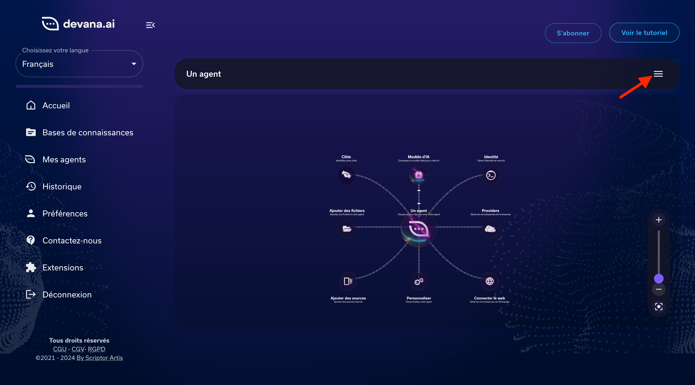
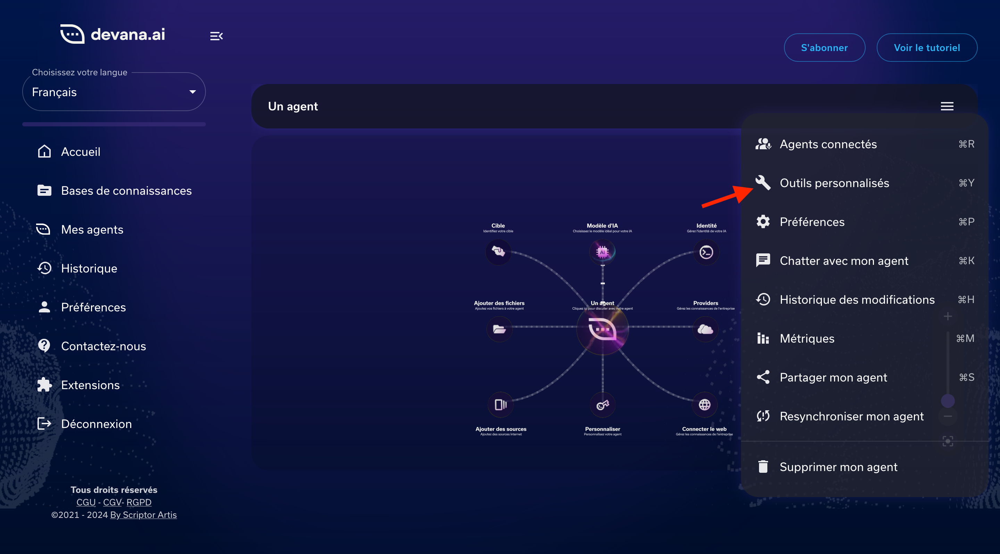
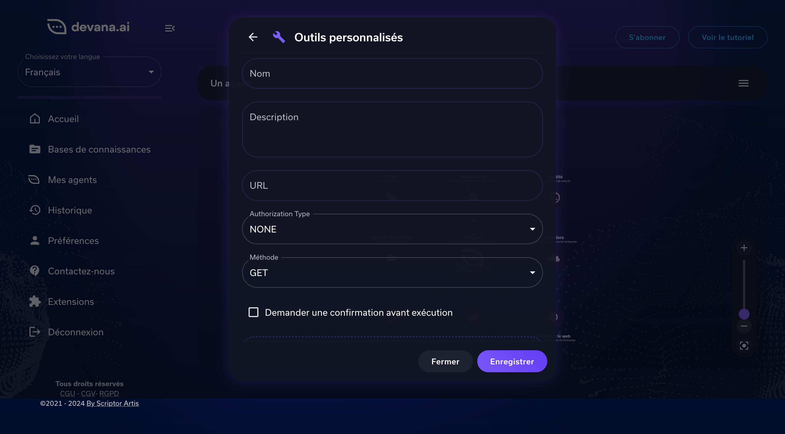
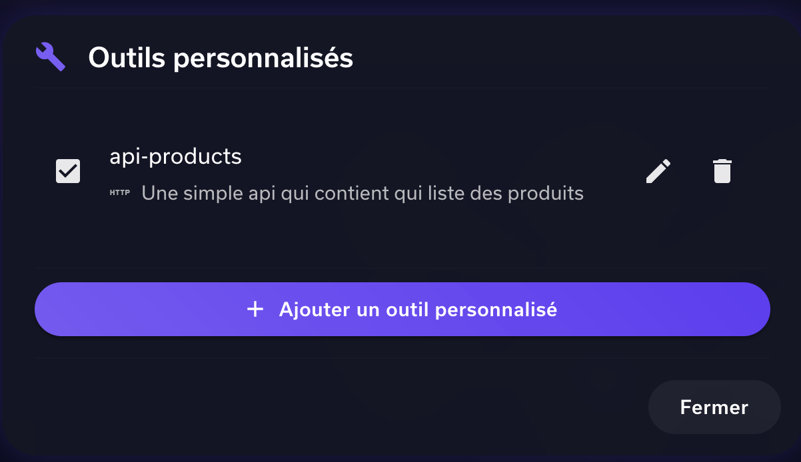
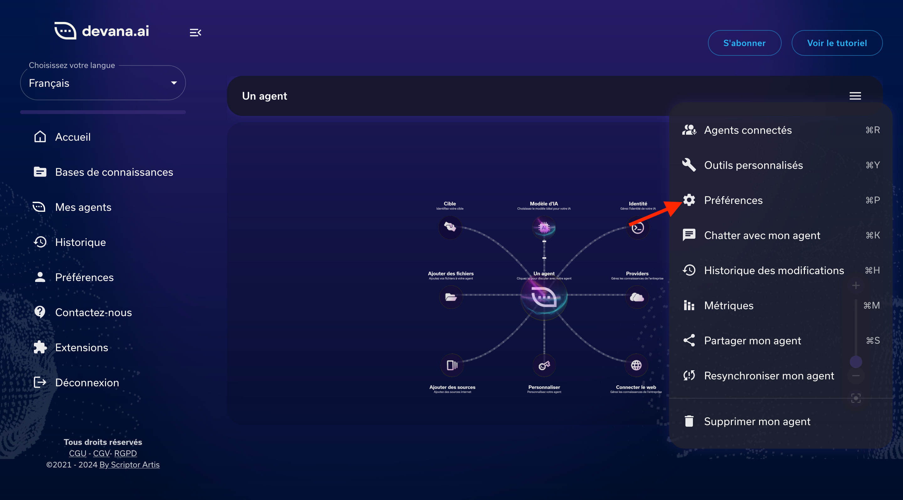

# Documentation Technique des Tools Devana


## Table des Matières
- [1. Introduction](#1-introduction)
- [2. Architecture et Fonctionnement des Tools](#2-architecture-et-fonctionnement-des-tools)
  - [Types de Tools](#types-de-tools)
  - [Configuration et utilisation des Tools](#configuration-et-utilisation-des-tools-sur-devana)
    - [Création d'un Tool](#création-dun-tool-sur-devana)
    - [Informations supplémentaires](#informations-supplémentaires)
- [3. Mise en Œuvre Technique des Tools](#3-mise-en-œuvre-technique-des-tools)
  - [Structure d'un Tool](#structure-dun-tool)
  - [Schéma de Validation](#schéma-de-validation)
    - [Fonctionnement des Schémas Zod](#fonctionnement-des-schémas-zod)
    - [Exemple de Schéma Zod](#exemple-de-schéma-zod)
  - [La Propriété `func` dans un Tool](#la-propriété-func-dans-un-tool)
    - [Exemple de `func` dans un Tool](#exemple-de-func-dans-un-tool)
    - [Exemple d'une implémentation complète](#exemple-dune-implémentation-complète)
  - [Gestion des Retours et Erreurs](#gestion-des-retours-et-erreurs)

## 1. Introduction

Les *tools* (ou outils) représentent des fonctions ou modules externes auxquels le LLM peut faire appel pour accomplir des tâches spécifiques. Contrairement aux capacités intrinsèques du modèle, basées uniquement sur ses données d'entraînement, les tools permettent de l’enrichir avec des fonctionnalités additionnelles. Ces outils élargissent ainsi la portée des actions du modèle : par exemple, il peut utiliser un tool pour effectuer une recherche dans une base de données, extraire des informations d’un document, ou vérifier des faits avant de répondre.

L’objectif de cette documentation est de fournir une vue d’ensemble technique des tools utilisés dans Devana, en expliquant leur rôle et leur intégration avec le LLM.


## 2. Architecture et Fonctionnement des Tools

Cette section explore le fonctionnement général des tools sur Devana et décrit leurs différentes catégories, ainsi que les options de configuration pour les adapter aux besoins spécifiques de l'application.

### Types de Tools

1. **Tools Standards** : Ces tools sont intégrés directement dans le LLM et s’activent automatiquement selon les besoins du modèle, sans intervention des développeurs. Ils gèrent des tâches de base pour lesquelles le modèle a été conçu.

2. **Tools Personnalisés Développés** : Ajoutés par l’équipe de développement pour répondre aux besoins spécifiques de l’application, ces tools sont configurés pour des tâches complexes, comme la recherche en base vectorielle ou la recherche web. Ils sont spécialement intégrés pour enrichir le LLM avec des capacités supplémentaires pertinentes pour l’application.

3. **Custom Tools Clients** : Ces tools sont configurables par les utilisateurs finaux (clients). Chaque client peut définir un tool en renseignant des informations telles que le nom, la description, le schéma de validation (Zod), l’URL du service cible, et les clés API nécessaires. Ce niveau de personnalisation permet aux clients de créer des outils adaptés à leurs besoins spécifiques, offrant une flexibilité maximale pour l’utilisation du modèle dans différents contextes.


### Configuration et utilisation des Tools sur Devana

Chaque type de tool peut être configuré de plusieurs façons pour répondre aux besoins de l'application :

#### Création d'un Tool sur Devana

Sur Devana, pour créer un tool, il faut accéder à l'interface d'un agent, puis cliquer la barre d'outils en haut à droite, puis choisir "Outils personnalisés".




Par la suite un formulaire s'ouvre, permettant de renseigner les différentes propriétés du tool.



Voici une description des différents champs :

- **Nom** : Le nom du tool, il doit être unique, il doit contenir que des lettes minuscules et les caractères spéciaux `-` et `_`, et ne pas dépasser 64 caractères.

- **Description** : La description du tool, elle doit être concise et précise, elle doit décrire en quelques mots la fonction du tool, elle ne doit pas dépasser 128 caractères.

- **URL** : L'URL du service cible, elle doit être correctement formatée, et doit être accessible depuis internet.

- **Type d'authentification** : Le type d'authentification nécessaire pour accéder au service cible, il peut être `None`, `Headers` ou `Query`. Le type `Headers` nécessite de renseigner la clé API dans les headers de la requête, le type `Query` nécessite de renseigner la clé API dans les query params de la requête et le type `None` ne nécessite pas d'authentification.

- **Paramètre d'authentification** : Le paramètre d'authentification qui va contenir la valeur de la clé API, il est requis si le type d'authentification est `Headers` ou `Query`. Exemple pour le type `Headers` : Authorization

- **Clé API** : La clé API. Exemple pour le type `Headers` : `Bearer API_KEY`.

- **Méthode HTTP** : La méthode HTTP à utiliser pour la requête, elle peut être `GET` et `POST`.

- **Confirmation d'Exécution** : une option permettant d’activer une validation d'exécution du tool. Ce mécanisme de confirmation permet d’exiger une validation manuelle avant d’exécuter un tool client, notamment pour les actions sensibles ou critiques.

- **Schéma d'arguments** : Ce sont les arguments attendus par le tool, ils sont définis en utilisant le schéma Zod. Exemple si je veux récupérer des données à partir d'une API externe, je peux définir un schéma avec un champ `id` de type `string` pour récupérer des données en fonction d'un identifiant.

- **Limitation du Nombre d'Appels** : Cette option permet de limiter le nombre d'appels d'un tool dans une session ou interaction, mais elle s'applique au niveau d'un agent globalement, et non individuellement pour chaque tool. Cette configuration est ajustable via une interface de paramètres sur l'agent, permettant ainsi un contrôle global de la fréquence d’utilisation des tools.


#### Informations supplémentaires

Vous trouverez ci-dessous des informations supplémentaires sur la configuration des tools sur vos agents.

##### Accésibilité du Tool
Chaque tool personnalisé est accessible pour tous les agents, il suffit juste de les activer pour chaque agent.



##### Limitation du nombre d'appels
Dans l'interface d'un agent, vous pouvez accéder aux paramètres de l'agent en cliquant sur le bouton en forme de rouage en haut à droite.



Vous pouvez alors renseigner le nombre maximum d'appels pour les tools.


##### Ajout du header `x-user-id` lors de l'utilisation des tools personnalisés

Lorsque qu'un agent utilise un custom, l'application ajoute automatiquement le header suivant à la requête envoyée au service cible :

**Header** x-user-id : Ce header est automatiquement rempli avec l'identifiant unique (cuid) de l'utilisateur qui communique avec l'agent.

## 3. Mise en Œuvre Technique des Tools

### Structure d'un Tool

- **name** : Cette propriété représente le nom unique du tool, utilisé pour l’identifier et l’appeler dans l'application. Ce nom doit être clair et représentatif de la fonctionnalité du tool pour faciliter sa gestion et son utilisation.

- **description** : La description résume la fonction principale du tool, guidant également le LLM dans l'identification des situations où le tool peut être pertinent pour répondre aux demandes des utilisateurs. En l'absence de description, une valeur par défaut est fournie, indiquant que la fonction du tool n'est pas spécifiée.

- **schema** : Le schéma définit la structure des données d'entrée attendues par le tool. En utilisant un schéma de validation (tel que Zod), cette propriété garantit que les données fournies à chaque appel respectent les formats requis, ce qui réduit les erreurs dues à des entrées incorrectes. Elle aide aussi à uniformiser les inputs pour les tools.

- **func** : La fonction func contient la logique d'exécution du tool. Elle prend en entrée les données validées par le schéma et effectue les actions nécessaires pour atteindre l'objectif du tool, comme une requête à une API externe ou un traitement de données. Cette fonction est au cœur du tool, car elle définit son comportement et ses résultats.

### Schéma de Validation

Pour garantir la cohérence et la sécurité des données échangées, chaque tool passe par un processus de validation à l’aide de schémas définis en utilisant la librairie **Zod**. Ces schémas de validation sont appliqués à l’entrée (input) et à la sortie (output) des tools pour s’assurer que les données respectent les formats attendus.

#### Fonctionnement des Schémas Zod

1. **Schémas pour les Tools Personnalisés** : Les tools personnalisés développés par l’équipe de développement suivent des schémas Zod définis dans le code source. Par exemple, un tool de recherche en base vectorielle pourrait exiger un champ de type `string` pour la requête et un champ `number` pour limiter le nombre de résultats.

#### Exemple de Schéma Zod

```javascript
import { z } from 'zod';

const schema = z.object({
  query: z.string().describe("La requête à exécuter."),
  maxResults: z.number().describe("Le nombre maximum de résultats à retourner."),
});
```

#### La Propriété `func` dans un Tool

La propriété `func` est la fonction principale qui définit le comportement du tool. Elle contient la logique d'exécution du tool, prenant en entrée les données validées selon le schéma et effectuant les actions nécessaires pour atteindre l’objectif du tool. Par exemple, `func` peut envoyer une requête HTTP à une API externe, traiter des données ou exécuter une tâche locale.

### Exemple de `func` dans un Tool

Voici un exemple de tool qui envoie une requête GET à une API pour récupérer des données en fonction d’un paramètre donné par l’utilisateur.

```typescript
const CustomTool = (tool: CustomTool) => {
  name: "GetDataTool",
  description: "Tool pour récupérer des données à partir d'une API externe",
  schema: z.object({
    query: z.string().describe("les paramètres de la requête à exécuter.")
  }),
  func: async (params) => {
    try {
      // Construit l'URL avec le paramètre de requête
      const finalUrl = `https://api.example-product.com/api/data?query=${encodeURIComponent(params.query)}`;

      
      const response = await fetch(finalUrl, {
        method: "GET",
        headers: {
          "Content-Type": "application/json",
          "Authorization": `Bearer ${tool.apiKey}`
        }
      });

      // Vérifie que la requête a réussi
      if (!response.ok) {
        throw new Error(`Erreur HTTP ! Statut : ${response.status}`);
      }

      // Convertit la réponse en JSON
      const data = await response.json();

      // Retourne les données sous forme de chaîne JSON
      return JSON.stringify(data);
    } catch (error) {
      // Gère les erreurs et retourne un message approprié
      return `Erreur lors de l'exécution du tool : ${error.message}`;
    }
  }
};
``` 

### Exemple d'une implémentation complète
Implémentation complète d'un tool basique dans un serveur expressjs

```typescript
import express from "express";
import { z } from "zod";

const app = express();
app.use(express.json());

// Exemple de tool : Récupération de données à partir d'une API externe
const GetDataTool = {
  name: "GetDataTool",
  description: "Tool pour récupérer des données à partir d'une API externe",
  schema: z.object({
    query: z.string().describe("Les paramètres de la requête à exécuter."),
  }),
  func: async (params) => {
    try {
      const finalUrl = `https://api.example-service.com/data?query=${encodeURIComponent(
        params.query
      )}`;
      const response = await fetch(finalUrl, {
        method: "GET",
      });

      const data = await response.json();
      return { success: true, data };
    } catch (error) {
      return { success: false, error };
    }
  },
};

// Route dynamique pour exécuter les tools
app.post("/tool", async (req, res) => {
  try {
    // Validation des données d'entrée avec Zod
    const validatedParams = GetDataTool.schema.parse(req.body);

    // Exécution de la fonction principale du tool
    const result = await GetDataTool.func(validatedParams);

    return res.json(result);
  } catch (error) {
    return res.json({ success: false, error });
  }
});

// Lancer le serveur
app.listen(3000, () => {
  console.log(`Serveur en cours d'exécution sur le port 3000`);
});
```
#### Gestion des Retours et Erreurs

Une fois la validation effectuée, les tools renvoient leurs résultats sous forme de données JSON ou d’objets spécifiques. En cas d’erreur, des messages d'erreur standardisés sont générés pour faciliter le débogage. Par exemple :

- **Erreur de Validation** : Si le schéma de validation n’est pas respecté, le tool renvoie un message d’erreur indiquant les champs en erreur et les raisons de l’échec de la validation.

- **Erreur de Connexion** : Si le tool est configuré pour utiliser une API externe, une erreur de connexion peut survenir si le service cible est inaccessible. Dans ce cas, le tool renvoie un message d’erreur indiquant que la connexion a échoué.

- **Erreur Inattendue** : En cas d’erreur inattendue, le tool renvoie un message d’erreur standard indiquant qu’une erreur est survenue lors de l’exécution du tool.


