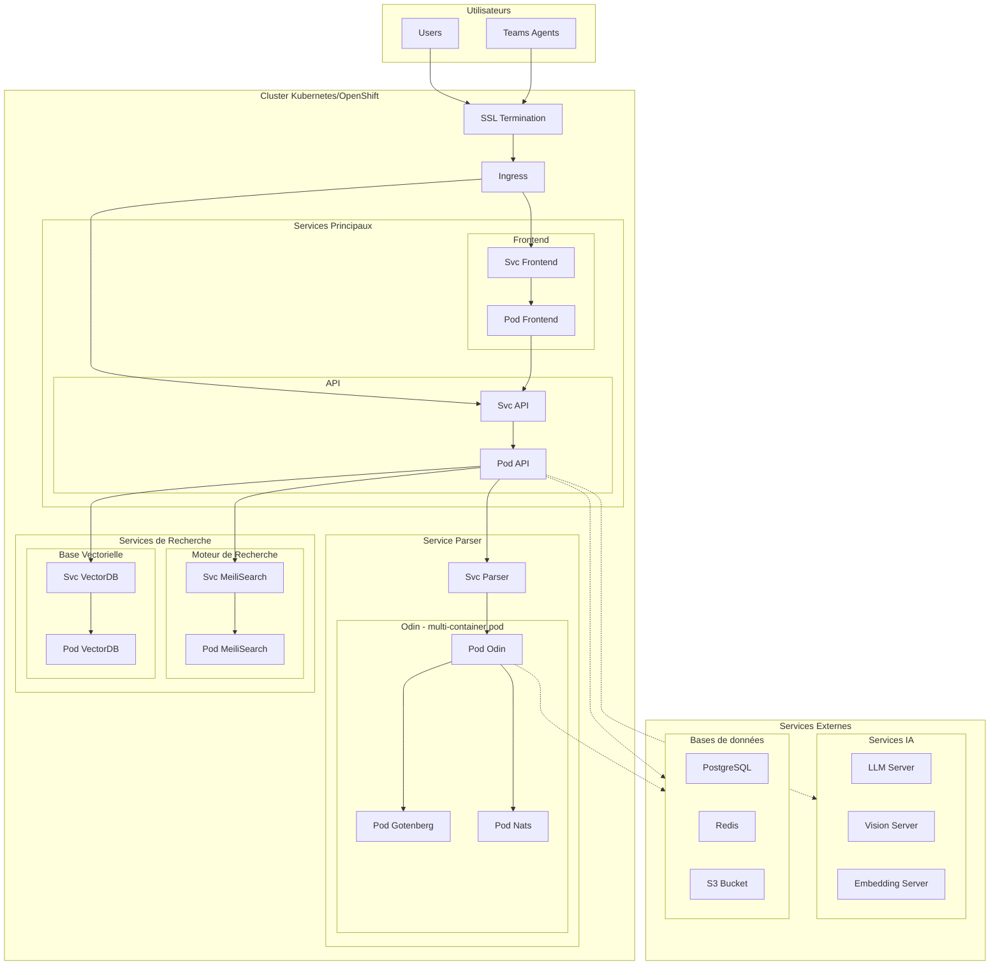
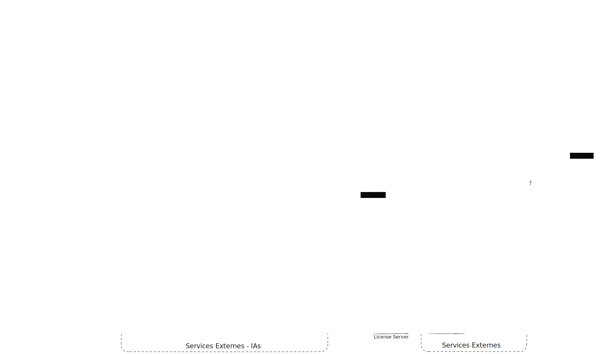

# Architecture Devana.ai

Documentation de l'architecture technique de la plateforme Devana.ai pour déploiement on-premise.

---

## Vue d'ensemble

L'infrastructure Devana.ai est composée de 8 composants critiques orchestrés par Kubernetes :

1. **Devana API** - Backend principal (Node.js, GraphQL, REST)
2. **Devana Frontend** - Interface web (Next.js)
3. **Odin** - Service de traitement de documents (Python)
4. **PostgreSQL** - Base de données relationnelle
5. **ChromaDB** - Base de données vectorielle (RAG)
6. **Meilisearch** - Moteur de recherche plein texte
7. **Redis** - Cache et gestion de sessions
8. **S3/MinIO** - Stockage d'objets (fichiers)

---

## Diagramme d'architecture Kubernetes



**Légende :**

- **Flèches pleines** : Connexions HTTP/gRPC synchrones
- **Flèches pointillées** : Connexions asynchrones ou optionnelles
- **Subgraphs** : Isolation logique des services

---

## Architecture réseau

[](./assets/on-prem-network2.svg)

### Segmentation réseau recommandée

**Zones de sécurité :**

```
Internet
    ↓
[DMZ] Load Balancer + WAF (10.0.1.0/24)
    ↓
[Application] Frontend + API (10.0.10.0/24)
    ↓
[Services] Odin, Redis, Meilisearch (10.0.20.0/24)
    ↓
[Data] PostgreSQL, ChromaDB (10.0.30.0/24)
    ↓
[AI] LLM, Embeddings (10.0.40.0/24)
```

**Isolation :** Chaque zone communique uniquement via ports spécifiques définis par Network Policies Kubernetes.

---

## Composants détaillés

### Devana API (Backend)

**Responsabilités :**

- Orchestration des requêtes LLM
- Gestion des agents et conversations
- Authentification et autorisation
- Webhook et intégrations externes
- GraphQL + REST API

**Dépendances :**

- PostgreSQL (données)
- ChromaDB (RAG)
- Redis (cache, sessions)
- Meilisearch (recherche)
- Odin (documents)
- LLM externe ou auto-hébergé

**Ports :**

- 4666 : HTTP/GraphQL/REST
- 5001 : WebSocket (temps réel)

### Devana Frontend

**Responsabilités :**

- Interface utilisateur web
- SSR (Server-Side Rendering)
- Gestion de session
- Upload de fichiers

**Dépendances :**

- API (backend)

**Ports :**

- 3000 : HTTP (Next.js)

### Odin (Multi-container pod)

**Responsabilités :**

- Extraction de contenu (PDF, Office, images)
- OCR (reconnaissance optique)
- Conversion de formats
- Vectorisation de documents
- Intégration providers (SharePoint, S3)

**Containers :**

- **Odin** : Service principal (Python)
- **Gotenberg** : Conversion documents (Go)
- **Nats** : Message queue interne

**Dépendances :**

- PostgreSQL
- S3/MinIO
- Embedding Server
- ChromaDB

**Ports :**

- 3003 : API Odin

### PostgreSQL

**Responsabilités :**

- Données structurées (users, agents, conversations)
- Metadata de fichiers
- Configuration système

**Configuration recommandée :**

- Version : 17.x
- Replication : Streaming replication (HA)
- Backup : WAL archiving + snapshots quotidiens

### ChromaDB

**Responsabilités :**

- Stockage de vecteurs (embeddings)
- Recherche par similarité (RAG)
- Index HNSW

**Configuration recommandée :**

- Persistence sur volumes PV
- 2-3 replicas pour HA
- Backup quotidien (snapshots)

### Meilisearch

**Responsabilités :**

- Recherche plein texte
- Indexation documents
- Filtres et facettes

**Configuration recommandée :**

- Index size : ~10x dataset size
- SSD obligatoire
- Typo tolerance configuré

### Redis

**Responsabilités :**

- Cache applicatif
- Sessions utilisateurs
- Files d'attente (queues)
- Rate limiting

**Configuration recommandée :**

- Cluster mode (HA) ou Sentinel
- Persistence : RDB + AOF
- Eviction policy : allkeys-lru

### S3/MinIO

**Responsabilités :**

- Stockage fichiers utilisateurs
- Fichiers temporaires Odin
- Assets statiques

**Configuration recommandée :**

- Cluster 4+ nodes (HA)
- Replication cross-region (DR)
- Lifecycle policies (archivage)

---

## Recommandations de dimensionnement par pod

### Configuration production

| Service         | CPU     | RAM  | Stockage | Replicas min    |
| --------------- | ------- | ---- | -------- | --------------- |
| **API**         | 3 cores | 4 GB | 20 GB    | 2-3             |
| **Frontend**    | 2 cores | 4 GB | 10 GB    | 2-3             |
| **Odin**        | 3 cores | 6 GB | 50 GB    | 2-4             |
| **Gotenberg**   | 2 cores | 3 GB | 10 GB    | Inclus pod Odin |
| **ChromaDB**    | 2 cores | 8 GB | 200 GB   | 2-3             |
| **Meilisearch** | 2 cores | 4 GB | 50 GB    | 2               |
| **Redis**       | 2 cores | 8 GB | 20 GB    | 3 (cluster)     |

**Notes :**

- **Odin** : Minimum 4 pods recommandés lors du premier run (ingestion massive de documents), puis réduire à 2-4 pods
- **ChromaDB** : 1 seul pod acceptable en dev, mais 2-3 replicas obligatoires en production
- **Redis** : Cluster 3 nodes minimum (1 master + 2 replicas) ou Sentinel

---

## Compatibilité Cloud

Devana.ai est compatible avec les principales plateformes cloud :

| Provider                  | Services managés supportés                                                    |
| ------------------------- | ----------------------------------------------------------------------------- |
| **Microsoft Azure**       | AKS, Azure Database for PostgreSQL, Azure Blob Storage, Azure Cache for Redis |
| **Amazon Web Services**   | EKS, RDS for PostgreSQL, S3, ElastiCache for Redis                            |
| **Google Cloud Platform** | GKE, Cloud SQL for PostgreSQL, Cloud Storage, Memorystore for Redis           |

**Prérequis minimaux (obsolètes - voir [requirements.md](./requirements.md)) :**

- ~~Kubernetes 1.19+~~ → **1.31+ requis**
- ~~PostgreSQL 12+~~ → **17.x recommandé**
- ~~Redis 6+~~ → **7.4+ recommandé**

---

## Performances et tests de charge

### Résultats de tests (configuration de base)

**Setup testé :**

- Agent GPT-4o-mini
- Base de connaissances moyenne
- Configuration : API 3 cores/4GB, Frontend 1 core/1GB

**Résultats (25 utilisateurs simultanés) :**

- Taux de réussite : **100%**
- Temps moyen de login : **12.06 secondes**
- Temps moyen de réponse agent : **36.20 secondes**
- Scalabilité : 25 users par set de containers (linéaire)

**Interprétation :**

- Pour 100 utilisateurs concurrents : 4x les ressources (API 4 pods, Frontend 4 pods)
- Pour 500 utilisateurs concurrents : 20x les ressources + scaling horizontal
- Pour 1000+ utilisateurs : Voir [requirements.md](./requirements.md) configuration entreprise

---

## Monitoring de licence

Le système on-premise envoie des métriques toutes les 5 minutes au serveur de licence Devana pour :

**Métriques collectées :**

- Utilisation CPU et mémoire (système)
- Nombre d'utilisateurs actifs
- Nombre de messages et tokens utilisés
- Nombre d'agents et bases de connaissances
- Informations réseau (interfaces, IPs, MACs)
- Identifiant du processus

**Usage :**

- Vérification conformité licence
- Maintenance proactive
- Support technique

**Sécurité :** Transmission chiffrée (TLS), données agrégées uniquement (pas de contenu utilisateur).

Plus de détails : [monitoring/license.md](./monitoring/license.md)

---

## Ressources complémentaires

- [Requirements détaillés](./requirements.md) - Dimensionnement complet
- [Configuration Kubernetes](./infrastructure/kubernetes/kube/README.md) - Procédures de déploiement
- [Variables d'environnement](./configuration/environment-variables.md) - Configuration complète
- [Health Checks](./monitoring/health-checks.md) - Surveillance

---

**Retour :** [Guide de déploiement](./README.md)
