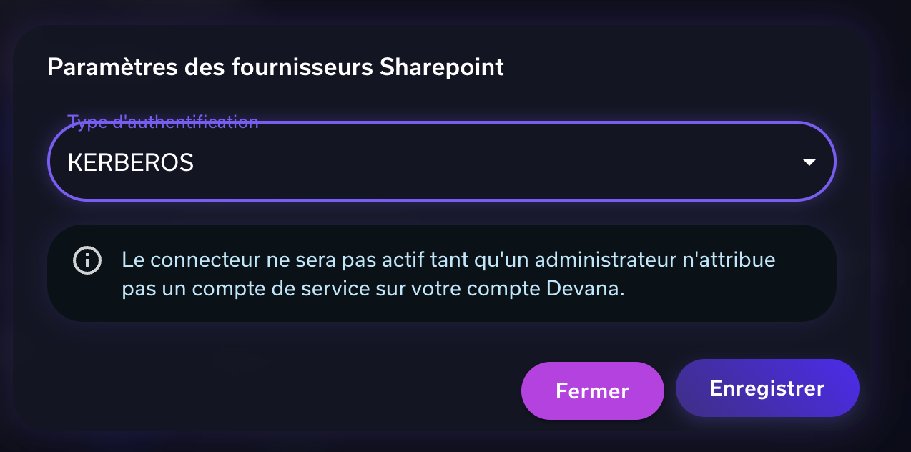
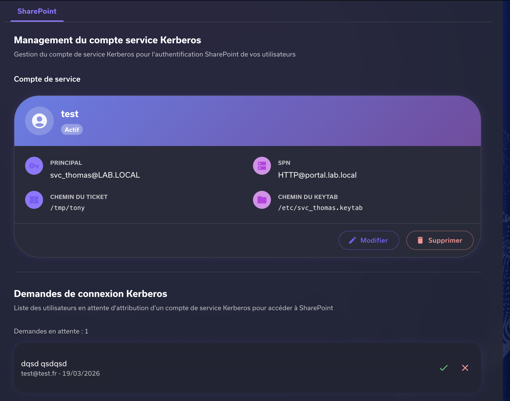
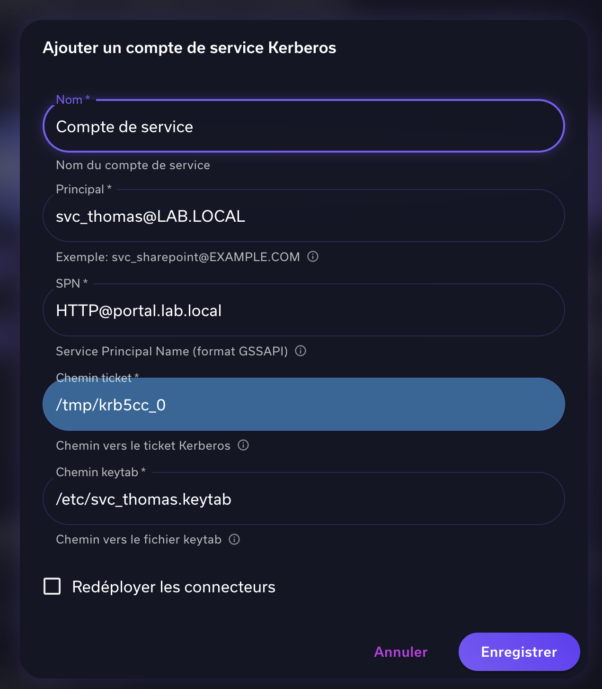
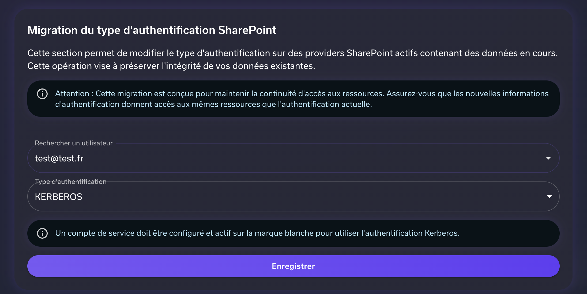

# Authentification Kerberos — Connecteur SharePoint

## Introduction

Cette documentation décrit la configuration et l'utilisation du type d'authentification Kerberos pour le connecteur SharePoint.

### Infrastructure (Système & Réseau)

Cette section décrit les prérequis et la configuration système nécessaires pour que l'authentification Kerberos fonctionne avec le connecteur SharePoint. Elle s'adresse aux administrateurs système et réseau responsables de l'infrastructure hébergeant Devana.

#### Prérequis Active Directory

Avant toute configuration côté serveur, les éléments suivants doivent être en place dans l'Active Directory (AD) :

**Compte de service AD** — Créer un compte de service dédié dans l'AD pour l'authentification Kerberos SharePoint (ex. `svc_sharepoint`) avec les droits nécessaires.

#### Configuration du fichier `krb5.conf`

Le fichier `/etc/krb5.conf` doit être présent sur le serveur (ou monté dans le conteneur) pour que le client Kerberos sache comment joindre le KDC (Key Distribution Center).

Exemple de configuration minimale :

```ini
[libdefaults]
    default_realm = EXAMPLE.COM
    dns_lookup_realm = false
    dns_lookup_kdc = true
    ticket_lifetime = 24h
    renew_lifetime = 7d
    forwardable = true
    default_ccache_name = FILE:/tmp/krb5cc_%{uid}

[realms]
    EXAMPLE.COM = {
        kdc = dc01.example.com
        admin_server = dc01.example.com
    }

[domain_realm]
    .example.com = EXAMPLE.COM
    example.com = EXAMPLE.COM
```

| Section | Description |
|---------|-------------|
| `[libdefaults]` | Configuration par défaut du client Kerberos : realm, durée de vie des tickets, chemin du cache. |
| `[realms]` | Adresse du KDC et du serveur d'administration pour chaque realm. Remplacer `dc01.example.com` par le FQDN de votre contrôleur de domaine. |
| `[domain_realm]` | Mapping entre les noms de domaine DNS et les realms Kerberos. |

> :warning: **Important :** Le `default_realm` doit être en **MAJUSCULES** et correspondre exactement au realm configuré dans l'AD.

Pour monter ce fichier dans le pod Kubernetes, créer un `ConfigMap` puis le référencer comme volume :

```yaml
apiVersion: v1
kind: ConfigMap
metadata:
  name: krb5-config
data:
  krb5.conf: |
    [libdefaults]
        default_realm = EXAMPLE.COM
        dns_lookup_realm = false
        dns_lookup_kdc = true
        ticket_lifetime = 24h
        renew_lifetime = 7d
        forwardable = true
        default_ccache_name = FILE:/tmp/krb5cc_0
    [realms]
        EXAMPLE.COM = {
            kdc = dc01.example.com
            admin_server = dc01.example.com
        }
    [domain_realm]
        .example.com = EXAMPLE.COM
        example.com = EXAMPLE.COM
```

Puis dans le `Deployment` :

```yaml
spec:
  containers:
    - name: devana
      volumeMounts:
        - name: krb5-config
          mountPath: /etc/krb5.conf
          subPath: krb5.conf
          readOnly: true
  volumes:
    - name: krb5-config
      configMap:
        name: krb5-config
```

Vous pouvez également définir la variable d'environnement `KRB5_CONFIG` si le fichier se trouve à un emplacement non standard :

```yaml
env:
  - name: KRB5_CONFIG
    value: /chemin/vers/krb5.conf
```

#### Génération et déploiement du fichier keytab

Le fichier keytab contient les clés chiffrées du compte de service, permettant une authentification Kerberos sans mot de passe interactif.

##### Génération du keytab (sur le contrôleur de domaine ou une machine jointe au domaine)

```bash
ktpass -princ HTTP/portal.example.com@EXAMPLE.COM \
       -mapuser svc_sharepoint@EXAMPLE.COM \
       -pass <mot_de_passe_du_compte> \
       -crypto AES256-SHA1 \
       -ptype KRB5_NT_PRINCIPAL \
       -out svc_sharepoint.keytab
```

| Option | Description |
|--------|-------------|
| `-princ` | Le SPN complet avec le realm (doit correspondre au SPN enregistré via `setspn`). |
| `-mapuser` | Le compte AD auquel le SPN est associé. |
| `-crypto` | L'algorithme de chiffrement. Privilégier `AES256-SHA1` pour la sécurité. |
| `-out` | Le chemin de sortie du fichier keytab généré. |

##### Déploiement du keytab sur le serveur

1. Créer un `Secret` Kubernetes contenant le keytab :
   ```yaml
   apiVersion: v1
   kind: Secret
   metadata:
     name: krb5-keytab
   type: Opaque
   data:
     svc_sharepoint.keytab: <contenu_du_keytab>
   ```

2. Monter le secret dans le `Deployment` :
   ```yaml
   spec:
     containers:
       - name: devana
         volumeMounts:
           - name: krb5-keytab
             mountPath: /etc/svc_sharepoint.keytab
             subPath: svc_sharepoint.keytab
             readOnly: true
     volumes:
       - name: krb5-keytab
         secret:
           secretName: krb5-keytab
           defaultMode: 0400
   ```

#### Initialisation et renouvellement des tickets Kerberos

Le connecteur SharePoint utilise le ticket Kerberos stocké dans le fichier cache (ccache) référencé par le champ **Chemin ticket** du compte de service (ex. `/tmp/krb5cc_0`).

### Application

Cette section couvre exclusivement le volet applicatif de la configuration Kerberos côté Devana. Elle s'adresse aux administrateurs de la Marque Blanche et détaille les actions suivantes :

- Sélection de Kerberos comme type d'authentification SharePoint (côté utilisateur)
- Création et gestion du compte de service Kerberos dans le dashboard admin
- Validation des demandes de connexion des utilisateurs
- Migration du type d'authentification d'un compte Devana existant

---

## Flow de configuration — Vue d'ensemble

Le flow de mise en place de l'authentification Kerberos pour SharePoint suit les mêmes étapes principales que l'authentification Basic. La différence essentielle réside dans la nécessité d'une validation par un administrateur avant que le connecteur ne devienne actif.

### Étapes du flow initial

1. **Configuration côté utilisateur** — L'utilisateur final sélectionne KERBEROS comme type d'authentification dans les paramètres de son fournisseur SharePoint.
2. **Enregistrement de la demande** — La plateforme enregistre la demande et place le connecteur en attente. Celui-ci reste inactif jusqu'à validation.
3. **Validation par l'administrateur** — L'administrateur Marque Blanche reçoit la demande dans le dashboard et l'approuve en l'associant au compte de service Kerberos configuré.
4. **Activation du connecteur** — Une fois la demande approuvée, le connecteur SharePoint de l'utilisateur devient actif et l'authentification Kerberos est opérationnelle.
---

## Configuration côté utilisateur

### Sélection du type d'authentification Kerberos

L'utilisateur accède aux paramètres de son fournisseur SharePoint depuis son interface Devana. Dans la fenêtre modale « Paramètres des fournisseurs Sharepoint », il sélectionne **KERBEROS** dans le menu déroulant *Type d'authentification*, puis clique sur **Enregistrer**.



Un message informatif s'affiche alors pour indiquer que le connecteur est en attente de validation administrative :

> :warning: Le connecteur ne sera pas actif tant qu'un administrateur n'attribue pas un compte de service sur votre compte Devana.

L'utilisateur n'a aucune autre action à effectuer. Il doit attendre la confirmation de son administrateur Marque Blanche.

---

## Dashboard Administrateur — Gestion Kerberos

L'ensemble de la gestion Kerberos pour SharePoint est centralisée dans le dashboard d'administration Marque Blanche. Pour y accéder :

1. Se rendre au dashboard d'administration Marque Blanche
2. Naviguer vers l'onglet **Connecteurs** dans le menu latéral
3. Sélectionner **SharePoint**

La page SharePoint se divise en trois sections distinctes :

- Management du compte de service Kerberos
- Demandes de connexion Kerberos en attente
- Migration du type d'authentification



### Management du compte de service Kerberos

Cette section permet de créer, consulter, modifier ou supprimer le compte de service Kerberos utilisé pour authentifier les utilisateurs SharePoint de la Marque Blanche.

Un seul compte de service peut être actif à la fois. La carte du compte affiche les informations suivantes :

- **Nom du compte**
- **Principal** — l'identité Kerberos du compte de service
- **SPN** — le Service Principal Name associé au service SharePoint
- **Chemin du ticket** — le chemin vers le fichier de ticket Kerberos sur le serveur
- **Chemin du keytab** — le chemin vers le fichier keytab du compte de service sur le serveur

#### Création d'un compte de service

Pour ajouter un nouveau compte de service Kerberos, cliquer sur le bouton d'ajout. La fenêtre modale « Ajouter un compte de service Kerberos » s'ouvre :



#### Détail des champs du formulaire

| Champ | Description | Exemple |
|-------|-------------|---------|
| **Nom** * | Nom fonctionnel du compte de service, utilisé pour l'identifier dans l'interface admin. Champ libre. | `Compte SharePoint Prod` |
| **Principal** * | Identité Kerberos complète du compte de service au format UPN (User Principal Name). Doit correspondre au compte créé dans Active Directory. | `svc_sharepoint@EXAMPLE.COM` |
| **SPN** * | Service Principal Name au format GSSAPI. Identifie de façon unique le service SharePoint cible auprès du KDC Kerberos. Doit être enregistré dans l'AD via `setspn`. | `HTTP@portal.example.com` |
| **Chemin ticket** * | Chemin absolu vers le fichier de cache du ticket Kerberos (ccache) sur le serveur hébergeant le connecteur. Généralement dans `/tmp/`. | `/tmp/krb5cc_0` |
| **Chemin keytab** * | Chemin absolu vers le fichier keytab du compte de service sur le serveur. Ce fichier contient les clés chiffrées permettant l'authentification sans mot de passe. | `/etc/svc_sharepoint.keytab` |
| **Redéployer les connecteurs** | Option facultative. Si cochée, force le redéploiement de tous les connecteurs SharePoint actifs après la sauvegarde du compte de service. | — |

---

## Gestion des demandes de connexion Kerberos

La section « Demandes de connexion Kerberos » liste les utilisateurs Devana ayant configuré Kerberos comme type d'authentification SharePoint et dont le connecteur est en attente de validation.

Pour chaque demande, les informations suivantes sont affichées :

- Nom de l'utilisateur
- Adresse email associée au compte Devana
- Date de la demande

L'administrateur dispose de deux actions pour chaque demande :

- **Approuver** — associe l'utilisateur au compte de service Kerberos actif et active son connecteur SharePoint
- **Refuser** — rejette la demande et notifie l'utilisateur

> :warning: **Note :** Un compte de service Kerberos actif doit être configuré avant de pouvoir approuver des demandes. Sans compte de service, l'approbation est impossible.

> :warning: **Attention :** L'approbation d'une demande entraîne l'activation immédiate du connecteur SharePoint de l'utilisateur avec l'authentification Kerberos. Vérifiez que le compte de service dispose bien des droits d'accès aux ressources SharePoint concernées.

---

## Migration du type d'authentification

La section « Migration du type d'authentification SharePoint » permet de modifier rétroactivement le type d'authentification d'un utilisateur Devana dont le connecteur SharePoint est déjà actif et contient des données indexées.

> :warning: **Note :** Cette opération est conçue pour préserver l'intégrité des données existantes tout en permettant une transition vers Kerberos sans perte d'historique.



### Utilisation du formulaire de migration

Le formulaire de migration comprend deux champs :

- **Rechercher un utilisateur** — liste déroulante permettant de sélectionner le compte Devana de l'utilisateur dont on souhaite migrer l'authentification SharePoint.
- **Type d'authentification** — liste déroulante pour sélectionner le nouveau type d'authentification cible (ex. KERBEROS).

> :warning: **Attention :** Un compte de service Kerberos doit être configuré et actif sur la Marque Blanche pour pouvoir sélectionner KERBEROS comme type d'authentification cible. Sans compte de service actif, la migration sera bloquée.

### Points d'attention avant migration

Avant de procéder à une migration, il est impératif de vérifier les points suivants :

1. Le nouveau type d'authentification doit donner accès aux **mêmes ressources SharePoint** que l'authentification actuelle. Un changement de compte sans vérification préalable peut entraîner des incohérences dans les données.
2. Le compte de service Kerberos doit disposer des **permissions nécessaires** sur le site SharePoint de l'utilisateur concerné.
3. **Informer l'utilisateur final** avant d'effectuer la migration afin d'éviter toute interruption de service non anticipée.