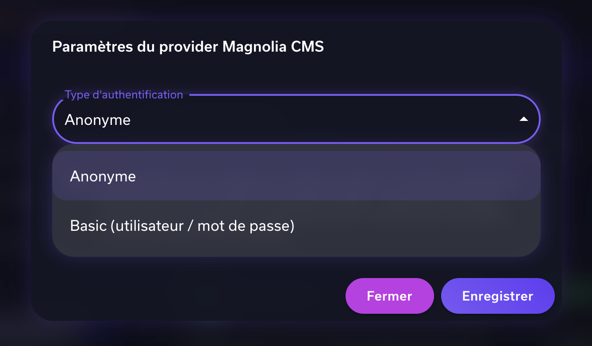
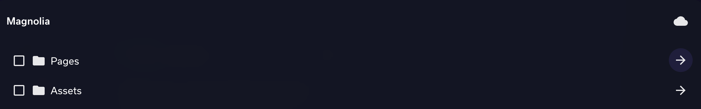
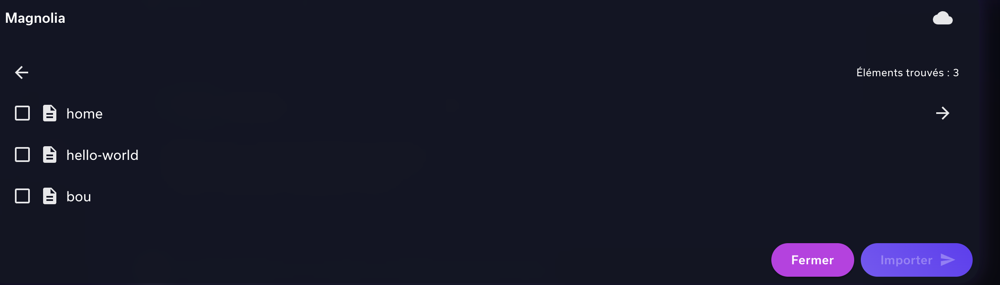
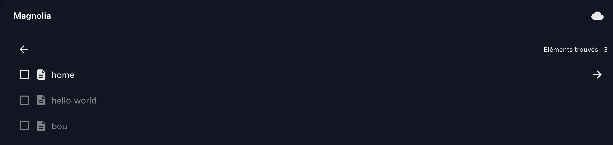
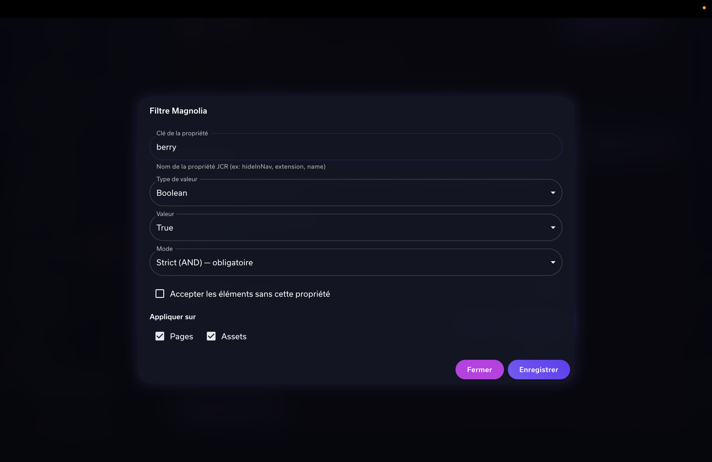

# Utilisation du connecteur Magnolia CMS dans Devana

## 1. Activation du connecteur

Dans **Paramètres > Connecteurs**, activez le connecteur **Magnolia CMS**.

Choisissez le type d'authentification :

| Mode | Description |
|------|-------------|
| **Anonyme** | Aucun identifiant requis. L'instance Magnolia doit autoriser l'accès anonyme à la Delivery API et au servlet DAM. |
| **Basic Auth** | Renseignez un **nom d'utilisateur** et un **mot de passe**. Les identifiants sont envoyés via le header `Authorization: Basic` sur chaque requête. |

---

## 2. Configuration du domaine

Lors de l'ajout du connecteur Magnolia sur une **base de connaissances** ou un **agent**, un dialogue vous demande de renseigner le **domaine** de votre instance Magnolia.

**Format attendu** : `host:port/context` (sans `http://`)

**Exemples** :
- `magnolia.mycompany.com` — instance en production
- `magnolia.mycompany.com/magnoliaPublic` — contenu publié uniquement
- `magnolia.mycompany.com/magnoliaAuthor` — contenu auteur (brouillons inclus)

> **magnoliaPublic** ne retourne que le contenu publié. **magnoliaAuthor** donne accès à tout le contenu, y compris les brouillons non publiés.

---

## 3. Parcours et sélection des documents

Une fois le connecteur configuré, l'interface de navigation affiche deux dossiers racines :

- **Pages** — arborescence des pages du site
- **Assets** — arborescence du DAM (images, PDF, documents)

### Navigation

- Cliquez sur la **flèche** pour naviguer dans les sous-dossiers/sous-pages
- Un **fil d'Ariane** permet de revenir aux niveaux précédents
- Le **nombre d'éléments** trouvés est affiché en haut de la liste

### Sélection

- Cochez les éléments que vous souhaitez **importer** dans votre base de connaissances
- Les **pages** sont importées avec leur contenu textuel (converti en Markdown)
- Les **assets** sont importés en tant que fichiers binaires (PDF, images, etc.)
- Cliquez sur **Importer** pour lancer la synchronisation des éléments sélectionnés
- Le bouton **cloud** en haut permet de synchroniser **l'intégralité** du connecteur

### Éléments filtrés

Si des filtres sont configurés (voir section suivante), les éléments qui ne correspondent pas aux critères apparaissent en **opacité réduite** et ne peuvent pas être sélectionnés. Les éléments déjà importés avant l'ajout d'un filtre restent sélectionnables.

---

## 4. Système de filtres

Les filtres permettent de restreindre les éléments visibles selon leurs **propriétés JCR** Magnolia. Ils se configurent dans le dialogue de domaine du connecteur.

### Créer un filtre

Chaque filtre se compose de :

| Champ | Description |
|-------|-------------|
| **Clé de la propriété** | Nom de la propriété JCR à évaluer (ex: `name`, `path`, `my_type`) |
| **Type de valeur** | `String`, `Long` (entier), `Double` (décimal), `Boolean`, `Date`, `Array` (multi-valeurs) |
| **Condition** | Opérateur de comparaison (dépend du type, voir ci-dessous) |
| **Valeur** | Valeur attendue pour la comparaison |
| **Mode** | `Strict (AND)` ou `Simple (OR)` |
| **Accepter nullable** | Si coché, les éléments qui n'ont **pas** cette propriété passent le filtre |
| **Appliquer sur** | `Pages`, `Assets`, ou les deux |

### Conditions par type

| Type | Conditions disponibles |
|------|----------------------|
| **String** | Égal, Pas égal, Contient, Ne contient pas, Commence par, Finit par |
| **Long / Double** | Égal, Pas égal, Supérieur, Inférieur, Supérieur ou égal, Inférieur ou égal |
| **Boolean** | Comparaison directe (true / false) |
| **Date** | Égal, Pas égal, Après, Avant, Après ou égal, Avant ou égal |
| **Array** | Contient au moins un, Contient tous |

### Modes de filtrage

- **Strict (AND)** : **Tous** les filtres en mode strict doivent correspondre pour que l'élément soit accepté
- **Simple (OR)** : **Au moins un** filtre en mode simple doit correspondre

Les deux modes se combinent : un élément doit passer tous les filtres strict **ET** au moins un filtre simple (s'il y en a).

### Exemples

| Cas d'usage | Configuration |
|-------------|---------------|
| Exclure les pages cachées de la navigation | Clé: `hideInNav`, Type: `Boolean`, Valeur: `false`, Mode: `Strict` |
| Ne garder que les PDF | Clé: `extension`, Type: `String`, Condition: `Égal`, Valeur: `pdf`, Mode: `Strict`, Appliquer sur: `Assets` |
| Filtrer par catégorie | Clé: `categories`, Type: `Array`, Condition: `Contient au moins un`, Valeur: `[uuid-catégorie]`, Mode: `Strict` |

> Les propriétés utilisées dans les filtres doivent être exposées par la Delivery API Magnolia.

### Filtrer par catégorie Magnolia

Si vous utilisez des **catégories Magnolia** dans vos filtres, vous devez renseigner leur **identifiant JCR** (`jcr:uuid`) comme valeur de filtre.

Pour récupérer cet identifiant :

1. Accédez au **dashboard Magnolia**
2. Naviguez jusqu'à la catégorie concernée
3. Utilisez la fonction **Export** sur cette catégorie
4. Dans le fichier exporté, repérez la clé **`jcr:uuid`** — c'est cette valeur qu'il faut utiliser dans le filtre
