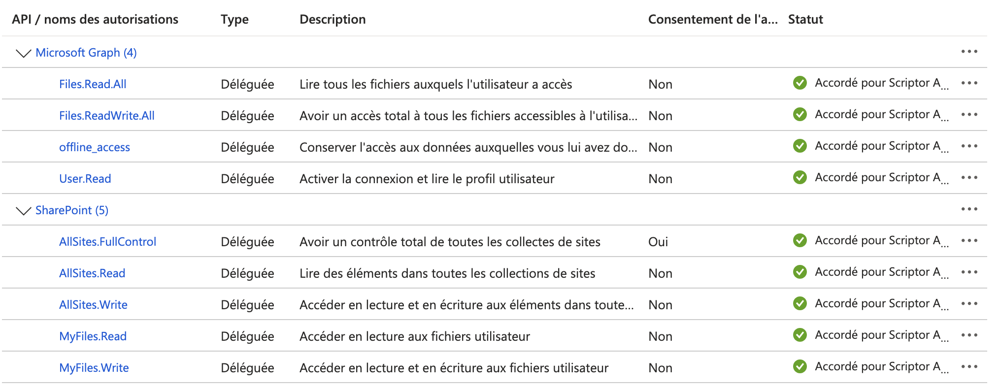
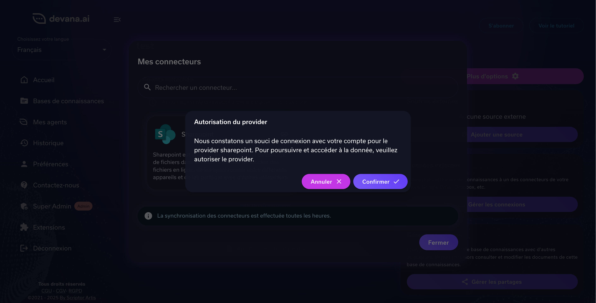

# Migration base de données – Anciennes données Sharepoint (deprecated)

## Introduction

Suite à la mise à jour de Devana et du microservice **API Devana Providers**, les données en base de données Sharepoint sont devenues obsolètes pour la logique d'authentification, de sélection de documents et des webhooks.

---

### Mise à jour au niveau Azure Directory

Suite à une mise à jour du microservice **API Devana Providers**, celui-ci nécessite de nouvelles autorisations dans la section **API autorisées** de votre Azure Directory.

Voici ci-dessous la bonne configuration :



---

### Migration de la DB pour restaurer les données

Pour restaurer les données au niveau de la base de données, veuillez lancer la requête suivante :

```bash
curl -X POST API_URL/migration/sharepoint/restore \
  -H "Content-Type: application/json" \
  -d '{
    "host": "tenant.sharepoint.com"
  }'
```  


Après l'exécution de la requête, si la migration a bien fonctionné, vous serez invité(e) dans l'une de vos bases de connaissance à restaurer votre jeton d'accès à Sharepoint :



---

### Récupération des tokens de suivi des changements

Une fois l'étape **Migration de la DB pour restaurer les données** terminée, vous devez récupérer les nouveaux tokens de suivi pour rétablir la synchronisation avec votre instance Sharepoint.

:warning: **Attention** : si l’un des comptes Devana n’a pas encore restauré son jeton d’accès, il sera impossible de récupérer un token de suivi valide pour ce compte.

Veuillez exécuter la commande ci-dessous :

```bash
curl -X POST API_URL/migration/sharepoint/restore/cursor \
  -H "Content-Type: application/json" \
  -d '{}'
