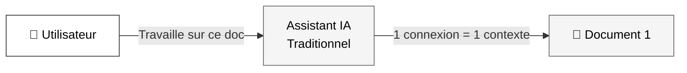
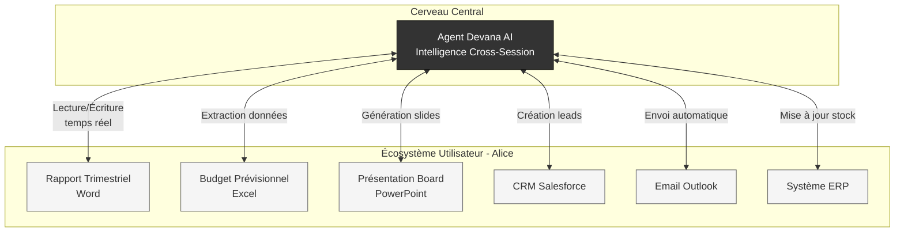
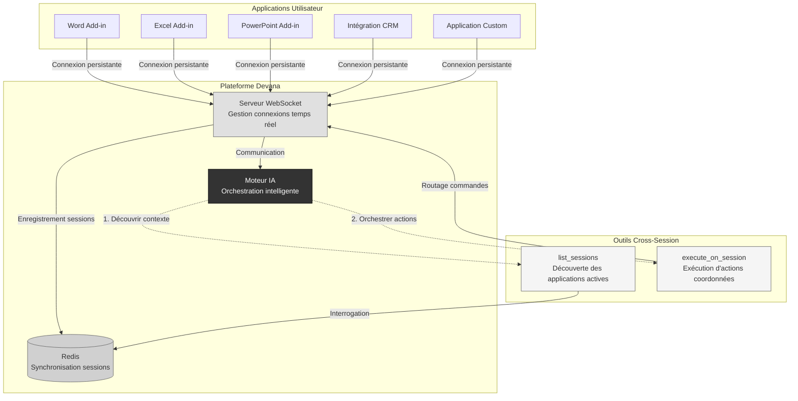
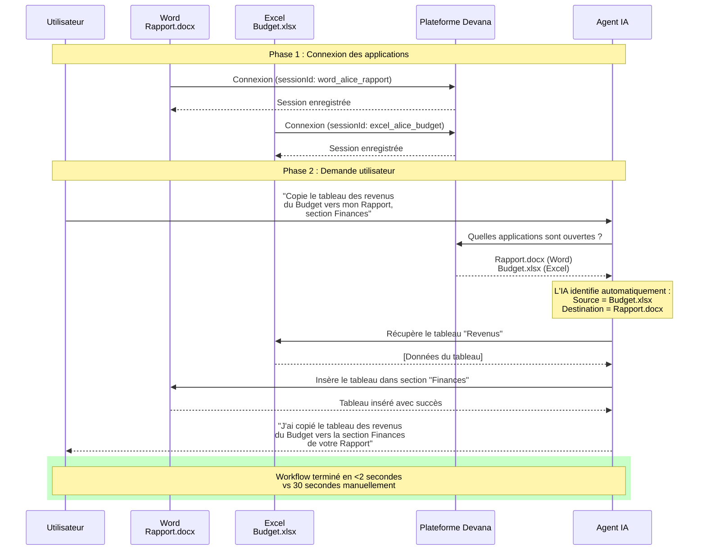
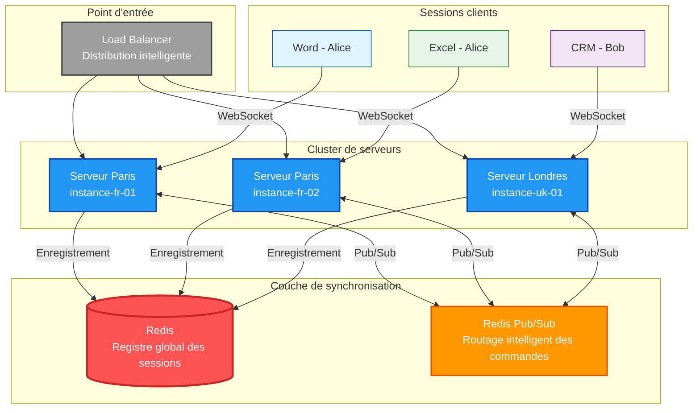
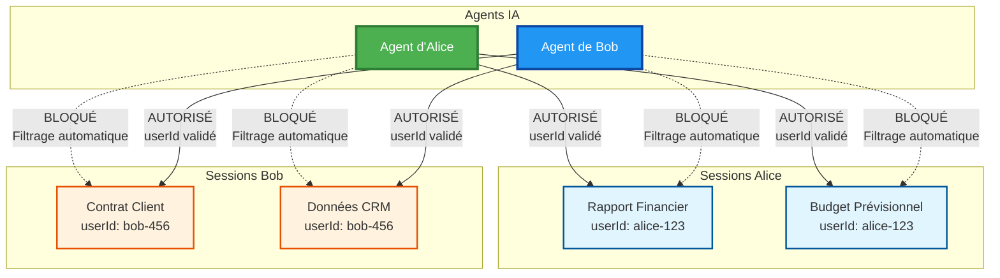

# Devana WebSocket Tools - Intelligence Cross-Session

**Version :** 2.0
**Audience :** Architectes d'entreprise, Décideurs IT, Product Managers

---

## Vue d'ensemble

Devana WebSocket Tools est une technologie qui permet à nos agents IA d'**interagir simultanément avec plusieurs applications et documents** d'un même utilisateur.

Cette capacité transforme l'IA d'un simple assistant mono-tâche en un **orchestrateur intelligent** capable de coordonner des workflows complexes entre vos outils métier.

---

## Cas d'usage métier

### Automatisation bureautique intelligente

L'agent IA peut lire un rapport Word, extraire des données d'un fichier Excel, et générer une présentation PowerPoint - **le tout en une seule instruction utilisateur**.

### Orchestration multi-applications

Synchronisation automatique entre votre CRM, vos documents contractuels, votre facturation et vos outils de suivi projet - **sans intégrations custom complexes**.

### Workflows cross-départements

Transfert intelligent de données entre les outils des équipes commerciales, marketing, finance et opérations - **en langage naturel**.

### IoT & Systèmes connectés

Pilotage coordonné de flottes d'appareils et systèmes industriels avec analyse contextuelle en temps réel.

---

## La révolution Cross-Session

### Le problème des assistants IA traditionnels

Les solutions IA du marché (ChatGPT, Copilot, etc.) souffrent d'une limitation fondamentale : **elles ne peuvent interagir qu'avec un seul contexte à la fois**.

**Conséquences pour l'entreprise :**

- Workflows séquentiels lents (changement de contexte manuel)
- Impossible de comparer ou croiser des données entre applications
- Pas de coordination automatique multi-outils
- L'utilisateur doit copier/coller manuellement entre applications
- Aucune vue d'ensemble du travail en cours

### Notre solution : Intelligence Cross-Session

Devana AI maintient des **connexions simultanées** avec tous les outils actifs de l'utilisateur et peut **orchestrer des actions coordonnées** entre eux.

**Bénéfices mesurables :**

- **Gain de temps : 10-20x** sur les workflows multi-documents
- **Zéro copier/coller** : Transferts automatiques entre applications
- **Analyse comparative** : Croisement intelligent de données hétérogènes
- **Workflows parallèles** : Traitement simultané de 10+ documents
- **Cohérence garantie** : Synchronisation automatique des modifications

---

## Exemples de workflows

### Scénario 1 : Préparation de Board Meeting

**Demande utilisateur :**
_"Prépare ma présentation Board : prends les chiffres du Budget Q4, compare avec le Rapport Financier, et crée une présentation avec analyse des écarts"_

**Actions automatiques de l'agent :**

1. Lecture du fichier Excel "Budget Q4.xlsx" → extraction des données financières
2. Analyse du document Word "Rapport Financier Q3.docx" → identification des KPIs
3. Calcul automatique des écarts et tendances
4. Génération de slides PowerPoint avec graphiques et insights
5. Présentation prête en 30 secondes vs 2-3 heures manuellement

---

### Scénario 2 : Gestion commerciale intégrée

**Demande utilisateur :**
_"Un client vient de signer le contrat dans mon Drive. Crée le lead dans Salesforce, envoie l'email de bienvenue, et mets à jour le tableau de suivi commercial"_

**Actions automatiques de l'agent :**

1. Extraction des données du contrat signé (nom, société, montant, dates)
2. Création automatique du lead dans Salesforce avec enrichissement
3. Génération et envoi d'un email personnalisé (modèle + données contrat)
4. Mise à jour du tableau Excel de suivi avec statut "Signé"
5. Création d'événements calendrier pour les jalons du projet
6. Workflow complet exécuté en <10 secondes

---

### Scénario 3 : Analyse multi-sources

**Demande utilisateur :**
_"Identifie les 10 clients les plus rentables du CRM, récupère leurs contrats, et génère un rapport d'analyse de profitabilité"_

**Actions automatiques de l'agent :**

1. Requête CRM : extraction top 10 clients par revenue
2. Collecte automatique des contrats associés (Drive/SharePoint)
3. Analyse financière : marges, coûts, récurrence
4. Calcul de metrics : LTV, CAC, Churn risk
5. Génération d'un rapport Word structuré avec tableaux et recommandations
6. Rapport de 15 pages généré en 2 minutes vs 1 journée d'analyste

---

## Architecture technique simplifiée

### Vue d'ensemble du système

**Principes clés :**

- **Connexions persistantes** : WebSocket maintient les liens avec toutes les applications actives
- **Synchronisation distribuée** : Redis assure la cohérence même avec plusieurs serveurs
- **Orchestration intelligente** : Le moteur IA décide automatiquement des actions à mener
- **Découverte automatique** : L'agent identifie les outils disponibles sans configuration manuelle

---

## Workflow utilisateur complet

### Exemple : Transfert de données Excel → Word

**Temps économisé :** 93% de réduction du temps d'exécution
**Erreurs éliminées :** Zéro risque de copier/coller incorrect
**Expérience utilisateur :** Une seule instruction en langage naturel

---

## Architecture scalable multi-serveurs

### Défi du scaling

Dans un environnement enterprise, les utilisateurs se connectent via un **load balancer** répartissant les requêtes sur plusieurs serveurs.

**Problématique :** Comment garantir que l'agent IA puisse communiquer avec une application connectée sur un serveur différent ?

### Solution : Redis Pub/Sub distribué

**Garanties système :**

1. **Disponibilité 99.99%** : Si un serveur tombe, les sessions sont automatiquement reprises
2. **Latence <50ms** : Routage optimisé via Redis Pub/Sub
3. **Scale horizontal** : Ajout de serveurs sans interruption de service
4. **Cohérence globale** : Registre unique des sessions actives dans Redis

**Bénéfices enterprise :**

- Support de 10,000+ utilisateurs simultanés
- Déploiement multi-régions (Paris, Londres, New York...)
- Haute disponibilité sans point de défaillance unique
- Performance constante quelle que soit la charge

---

## Sécurité et isolation utilisateur

### Principe : Isolation stricte par utilisateur

Chaque utilisateur ne peut accéder qu'à **ses propres sessions** - aucune fuite de données cross-utilisateur n'est possible.

### Mécanismes de protection

**Authentification renforcée :**

- Validation JWT systématique à chaque requête
- Extraction automatique du `userId` depuis le token (non-forgeable côté client)
- Révocation immédiate en cas de token expiré

**Isolation des données :**

- Filtrage automatique par `userId` dans tous les outils cross-session
- Impossible pour un agent d'accéder aux sessions d'un autre utilisateur
- Audit trail complet : traçabilité de chaque action

**Conformité réglementaire :**

- RGPD-compliant : droit à l'oubli, export des données
- SOC 2 Type II : contrôles d'accès, chiffrement, monitoring
- ISO 27001 : gestion des risques de sécurité

---

## ROI et bénéfices métier

### Gains de productivité mesurés

| Scénario                               | Temps manuel | Temps avec Devana | Gain    |
| -------------------------------------- | ------------ | ----------------- | ------- |
| Transfert de tableau Excel → Word      | 30 sec       | 2 sec             | **93%** |
| Création présentation depuis 3 sources | 2-3 heures   | 5 min             | **97%** |
| Synchronisation CRM + Documents        | 15 min       | 10 sec            | **99%** |
| Rapport d'analyse multi-sources        | 1 journée    | 5 min             | **95%** |

**Temps économisé :** **5-10 heures par utilisateur par semaine**
**ROI moyen :** **Retour sur investissement en <3 mois**

### Bénéfices qualitatifs

**Réduction des erreurs :**

- Élimination des erreurs de copier/coller (humaines)
- Cohérence garantie entre applications synchronisées
- Validation automatique des données transférées

**Amélioration de l'expérience utilisateur :**

- Instructions en langage naturel vs manipulations manuelles
- Workflows complexes simplifiés en une seule commande
- Moins de changements d'application (réduction de la charge cognitive)

**Agilité métier :**

- Nouveaux workflows implémentables sans développement custom
- Adaptabilité rapide aux changements d'outils métier
- Innovation facilitée par l'orchestration intelligente

---

## Cas d'usage par industrie

### Secteur Financier

- Génération automatique de rapports réglementaires depuis multiples systèmes
- Analyse de risque cross-portfolio en temps réel
- Synchronisation trading desk + back-office + compliance

### Santé

- Agrégation de dossiers patients depuis EMR + laboratoires + imagerie
- Génération de comptes-rendus médicaux structurés
- Coordination prescriptions + pharmacie + assurance

### Manufacturing

- Synchronisation ERP + MES + Supply Chain + Quality
- Génération automatique de documentation produit multi-sources
- Analyse de performance production en temps réel

### Retail / E-commerce

- Synchronisation catalogue produits + stocks + CRM + marketing
- Génération de campagnes personnalisées depuis données clients
- Analyse cross-canal (web + magasin + app mobile)

### Services Professionnels

- Génération de livrables clients depuis outils projet + temps + facturation
- Synchronisation CRM + propositions commerciales + contrats
- Reporting multi-projets automatisé

---

## Mise en œuvre

### Simplicité d'intégration

**Aucune infrastructure complexe à déployer :**

- SDK léger (< 50 KB) installable via NPM
- Connexion WebSocket sécurisée en quelques lignes
- Compatibilité navigateur moderne (Chrome, Edge, Safari, Firefox)

**Support de multiples plateformes :**

- Applications Office (Word, Excel, PowerPoint via Office Add-ins)
- Applications web custom (React, Vue, Angular...)
- Applications desktop (Electron, Tauri...)
- Systèmes industriels (via API REST/WebSocket)

### Documentation et support

**Pour les développeurs :**
Documentation technique complète sur **[NPM @devana/ws-tools](https://www.npmjs.com/package/@devana/ws-tools)**

## Mentions légales

**© 2025 Devana AI - Tous droits réservés**

Cette documentation est la propriété de Devana AI (Scriptor Artis). Toute reproduction, distribution ou utilisation commerciale sans autorisation écrite est interdite.

Les performances et temps de traitement indiqués sont basés sur des mesures réelles en environnement contrôlé. Les résultats peuvent varier selon la configuration et les cas d'usage spécifiques.
