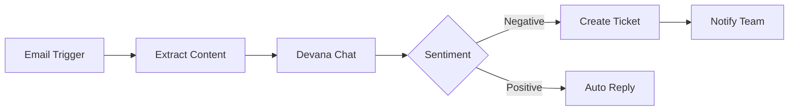
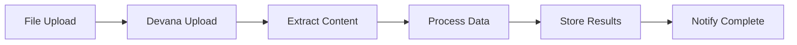

# n8n-nodes-devana

## Overview

`n8n-nodes-devana` is a community node package that integrates Devana AI into n8n workflows. It enables workflow automation with AI-powered conversations, document processing, and agent interactions directly within your n8n automation pipelines.

## Installation

### Community Nodes (Recommended)

1. In your n8n instance, go to **Settings** → **Community Nodes**
2. Click **Install a community node**
3. Enter: `n8n-nodes-devana`
4. Click **Install**

### Manual Installation

```bash
# Navigate to your n8n custom nodes folder
cd ~/.n8n/custom

# Install the package
npm install n8n-nodes-devana

# Restart n8n
n8n stop && n8n start
```

### Docker Installation

```dockerfile
FROM n8nio/n8n:latest

# Install community node
RUN cd /usr/local/lib/node_modules/n8n && \
    npm install n8n-nodes-devana
```

## Available Nodes

### 1. Devana Chat Node

Enables conversational AI interactions within workflows.

#### Configuration

| Property | Type | Required | Description |
|----------|------|----------|-------------|
| API Key | Credential | Yes | Your Devana API key |
| Agent ID | String | Yes | The AI agent to interact with |
| Conversation ID | String | No | Existing conversation or create new |
| Message | String | Yes | The message to send |
| Stream Response | Boolean | No | Enable streaming responses |
| Include Context | Boolean | No | Include previous messages |
| Max Tokens | Number | No | Maximum response length |
| Temperature | Number | No | Response creativity (0-1) |

#### Example Workflow

```json
{
  "nodes": [
    {
      "type": "n8n-nodes-devana.devanaChat",
      "name": "Ask Devana",
      "parameters": {
        "agentId": "{{$json.agentId}}",
        "message": "Analyze this customer feedback: {{$json.feedback}}",
        "temperature": 0.7,
        "includeContext": true
      },
      "credentials": {
        "devanaApi": {
          "id": "1",
          "name": "Devana API"
        }
      }
    }
  ]
}
```

### 2. Devana Document Node

Process and extract information from documents.

#### Configuration

| Property | Type | Required | Description |
|----------|------|----------|-------------|
| API Key | Credential | Yes | Your Devana API key |
| Operation | Select | Yes | upload, extract, status, delete |
| Folder ID | String | Yes* | Target folder for upload |
| Document ID | String | Yes* | For extract/status/delete |
| File | Binary/File | Yes* | For upload operation |
| Extract Options | Object | No | OCR, parsing settings |

#### Operations

##### Upload Document
```javascript
{
  "operation": "upload",
  "folderId": "folder-123",
  "file": "@/path/to/document.pdf",
  "extractText": true,
  "performOCR": true
}
```

##### Extract Content
```javascript
{
  "operation": "extract",
  "documentId": "doc-456",
  "format": "structured", // or "text", "markdown"
  "includeMetadata": true
}
```

##### Check Status
```javascript
{
  "operation": "status",
  "documentId": "doc-456"
}
```

### 3. Devana RAG Node

Query knowledge bases with Retrieval-Augmented Generation.

#### Configuration

| Property | Type | Required | Description |
|----------|------|----------|-------------|
| API Key | Credential | Yes | Your Devana API key |
| Agent ID | String | Yes | Agent with knowledge base |
| Query | String | Yes | Search query |
| Folders | Array | No | Specific folders to search |
| Max Results | Number | No | Number of results (default: 5) |
| Similarity Threshold | Number | No | Minimum relevance (0-1) |
| Include Sources | Boolean | No | Return source references |

#### Example Usage

```javascript
{
  "query": "What is our refund policy?",
  "folders": ["kb-policies", "kb-legal"],
  "maxResults": 3,
  "similarityThreshold": 0.7,
  "includeSources": true
}
```

### 4. Devana Workflow Trigger

Trigger n8n workflows from Devana conversations.

#### Configuration

| Property | Type | Required | Description |
|----------|------|----------|-------------|
| Webhook URL | String | Yes | Auto-generated webhook endpoint |
| Agent ID | String | Yes | Agent to monitor |
| Event Type | Select | Yes | message, tool_call, conversation_end |
| Filters | Object | No | Event filtering rules |

## Common Workflow Patterns

### Customer Support Automation



**Implementation:**

```json
{
  "nodes": [
    {
      "type": "n8n-nodes-email.emailTrigger",
      "name": "New Support Email"
    },
    {
      "type": "n8n-nodes-devana.devanaChat",
      "name": "Analyze Sentiment",
      "parameters": {
        "message": "Analyze sentiment and intent: {{$json.text}}",
        "agentId": "support-agent"
      }
    },
    {
      "type": "n8n-nodes-base.if",
      "name": "Check Sentiment",
      "parameters": {
        "conditions": {
          "string": [
            {
              "value1": "{{$json.sentiment}}",
              "operation": "equals",
              "value2": "negative"
            }
          ]
        }
      }
    }
  ]
}
```

### Document Processing Pipeline



**Implementation:**

```json
{
  "nodes": [
    {
      "type": "n8n-nodes-devana.devanaDocument",
      "name": "Upload Document",
      "parameters": {
        "operation": "upload",
        "folderId": "{{$json.targetFolder}}",
        "extractText": true
      }
    },
    {
      "type": "n8n-nodes-devana.devanaDocument",
      "name": "Wait for Processing",
      "parameters": {
        "operation": "status",
        "documentId": "{{$json.documentId}}",
        "waitUntilComplete": true
      }
    },
    {
      "type": "n8n-nodes-devana.devanaChat",
      "name": "Analyze Content",
      "parameters": {
        "message": "Summarize key points from document {{$json.documentId}}"
      }
    }
  ]
}
```

### Knowledge Base Query System

```json
{
  "nodes": [
    {
      "type": "n8n-nodes-base.httpRequest",
      "name": "Receive Question"
    },
    {
      "type": "n8n-nodes-devana.devanaRAG",
      "name": "Search Knowledge Base",
      "parameters": {
        "query": "{{$json.question}}",
        "folders": ["kb-products", "kb-support"],
        "maxResults": 5
      }
    },
    {
      "type": "n8n-nodes-devana.devanaChat",
      "name": "Generate Answer",
      "parameters": {
        "message": "Based on these sources: {{$json.sources}}, answer: {{$json.question}}"
      }
    }
  ]
}
```

## Authentication

### Setting up Credentials

1. In n8n, go to **Credentials** → **New**
2. Search for "Devana API"
3. Enter your credentials:

```json
{
  "apiKey": "your-api-key-here",
  "baseUrl": "https://api.devana.ai" // Optional custom URL
}
```

### Environment Variables

```bash
# .env file for n8n
DEVANA_API_KEY=your-api-key
DEVANA_BASE_URL=https://api.devana.ai
N8N_CUSTOM_EXTENSIONS="/home/node/.n8n/custom"
```

## Advanced Features

### Streaming Responses

Enable real-time streaming for long AI responses:

```javascript
{
  "type": "n8n-nodes-devana.devanaChat",
  "parameters": {
    "streamResponse": true,
    "onChunk": {
      "enabled": true,
      "webhook": "{{$json.callbackUrl}}"
    }
  }
}
```

### Batch Processing

Process multiple items efficiently:

```javascript
{
  "type": "n8n-nodes-devana.devanaBatch",
  "parameters": {
    "operation": "chat",
    "items": "{{$items}}",
    "parallel": true,
    "batchSize": 10,
    "delayBetweenBatches": 1000
  }
}
```

### Custom Tool Integration

Expose n8n workflows as tools to Devana agents:

```javascript
{
  "type": "n8n-nodes-devana.devanaTool",
  "name": "Register Workflow as Tool",
  "parameters": {
    "toolName": "processInvoice",
    "description": "Process and validate invoices",
    "webhookUrl": "{{$json.webhookUrl}}",
    "parameters": {
      "invoiceId": "string",
      "validate": "boolean"
    }
  }
}
```

### Error Handling

Implement robust error handling:

```javascript
{
  "nodes": [
    {
      "type": "n8n-nodes-devana.devanaChat",
      "name": "AI Processing",
      "continueOnFail": true
    },
    {
      "type": "n8n-nodes-base.if",
      "name": "Check Success",
      "parameters": {
        "conditions": {
          "boolean": [
            {
              "value1": "={{$json.error}}",
              "operation": "isEmpty"
            }
          ]
        }
      }
    },
    {
      "type": "n8n-nodes-core.errorWorkflow",
      "name": "Handle Error",
      "parameters": {
        "errorMessage": "{{$json.error.message}}",
        "errorCode": "{{$json.error.code}}"
      }
    }
  ]
}
```

## Performance Optimization

### Caching Responses

```javascript
{
  "type": "n8n-nodes-devana.devanaCache",
  "parameters": {
    "operation": "get",
    "key": "{{$json.queryHash}}",
    "fallback": {
      "node": "Devana Chat",
      "cache": true,
      "ttl": 3600
    }
  }
}
```

### Rate Limiting

```javascript
{
  "type": "n8n-nodes-devana.devanaRateLimit",
  "parameters": {
    "limit": 100,
    "window": "1h",
    "strategy": "sliding",
    "onLimit": "queue" // or "reject", "delay"
  }
}
```

## Monitoring and Logging

### Workflow Metrics

```javascript
{
  "type": "n8n-nodes-devana.devanaMetrics",
  "parameters": {
    "trackUsage": true,
    "trackLatency": true,
    "trackErrors": true,
    "exportTo": "prometheus" // or "datadog", "cloudwatch"
  }
}
```

### Debug Mode

Enable detailed logging:

```javascript
{
  "type": "n8n-nodes-devana.devanaChat",
  "parameters": {
    "debug": true,
    "logLevel": "verbose", // "error", "warn", "info", "verbose"
    "logTo": "console" // or "file", "webhook"
  }
}
```

## Best Practices

### 1. Use Environment Variables

```javascript
// Good
{
  "agentId": "{{$env.DEVANA_AGENT_ID}}"
}

// Bad
{
  "agentId": "agent-12345"
}
```

### 2. Implement Retry Logic

```javascript
{
  "retryOnFail": true,
  "maxRetries": 3,
  "retryInterval": 5000,
  "retryExponentialBackoff": true
}
```

### 3. Validate Inputs

```javascript
{
  "type": "n8n-nodes-base.function",
  "name": "Validate Input",
  "parameters": {
    "functionCode": `
      if (!items[0].json.message) {
        throw new Error('Message is required');
      }
      if (items[0].json.message.length > 4000) {
        items[0].json.message = items[0].json.message.substring(0, 4000);
      }
      return items;
    `
  }
}
```

### 4. Handle Rate Limits

```javascript
{
  "type": "n8n-nodes-base.wait",
  "name": "Rate Limit Delay",
  "parameters": {
    "resume": "wait",
    "amount": 1,
    "unit": "seconds"
  }
}
```

## Troubleshooting

### Common Issues

#### Authentication Failures
```bash
# Check API key is valid
curl -H "Authorization: Bearer YOUR_API_KEY" https://api.devana.ai/v1/agents

# Verify credentials in n8n
n8n credentials:test --name="Devana API"
```

#### Timeout Errors
```javascript
{
  "timeout": 30000, // Increase timeout to 30 seconds
  "retryOnTimeout": true
}
```

#### Memory Issues with Large Files
```javascript
{
  "type": "n8n-nodes-devana.devanaDocument",
  "parameters": {
    "streamUpload": true, // Stream large files
    "chunkSize": 5242880  // 5MB chunks
  }
}
```

### Debug Logging

Enable verbose logging in n8n:

```bash
# Set log level
export N8N_LOG_LEVEL=debug

# Enable node-specific logging
export DEBUG=n8n-nodes-devana:*

# Start n8n with logging
n8n start --log-level=debug
```

### Testing Workflows

```javascript
// Test node configuration
{
  "type": "n8n-nodes-devana.devanaTest",
  "parameters": {
    "test": "connection",
    "verbose": true
  }
}
```

## Version Compatibility

| n8n Version | Node Package Version | Notes |
|-------------|---------------------|-------|
| 1.0.0+ | 2.x.x | Full compatibility |
| 0.200.0+ | 1.x.x | Limited streaming support |
| < 0.200.0 | Not supported | Upgrade n8n |

## Migration Guide

### From v1.x to v2.x

1. **Credential Changes:**
```javascript
// v1.x
{
  "apiKey": "key"
}

// v2.x
{
  "authentication": {
    "type": "apiKey",
    "apiKey": "key"
  }
}
```

2. **Node Parameter Updates:**
```javascript
// v1.x
{
  "type": "devanaChat"
}

// v2.x
{
  "type": "n8n-nodes-devana.devanaChat"
}
```

## Examples Repository

Full workflow examples available at:
- [GitHub](https://github.com/devana-ai/n8n-nodes-devana/examples)
- [n8n Templates](https://n8n.io/workflows?search=devana)

## Support and Resources

- **Documentation**: [docs.devana.ai/integrations/n8n](https://docs.devana.ai/integrations/n8n)
- **GitHub Issues**: [github.com/devana-ai/n8n-nodes-devana/issues](https://github.com/devana-ai/n8n-nodes-devana/issues)
- **Community Forum**: [community.n8n.io/c/nodes/devana](https://community.n8n.io/c/nodes/devana)
- **Discord**: [discord.gg/devana](https://discord.gg/devana)
- **Email Support**: n8n-support@devana.ai

## Contributing

Contributions are welcome! See [CONTRIBUTING.md](https://github.com/devana-ai/n8n-nodes-devana/CONTRIBUTING.md) for guidelines.

## License

MIT License - See [LICENSE](https://github.com/devana-ai/n8n-nodes-devana/LICENSE) file for details.